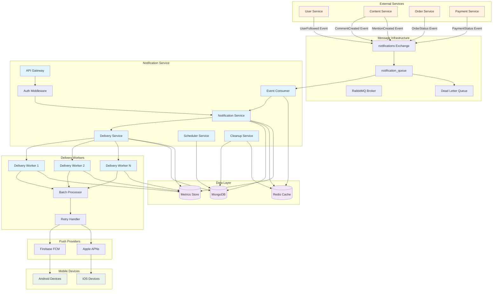

# System Overview & Architecture

## 1. System Overview Diagram



## 2. High-Level Architecture Principles

### Event-Driven Architecture
- **Producers**: External services publish domain events
- **Broker**: RabbitMQ handles reliable message delivery
- **Consumer**: Idempotent event processing with deduplication
- **Workers**: Parallel notification delivery processing

### Key Characteristics
- ✅ **Scalable**: Horizontally scalable workers and consumers
- ✅ **Resilient**: Circuit breakers, retries, dead letter queues
- ✅ **Observable**: Comprehensive metrics and logging
- ✅ **Secure**: JWT auth, rate limiting, TLS encryption
- ✅ **Performant**: Redis caching, connection pooling

## 3. Service Boundaries

### Notification Service Responsibilities
- Event consumption and validation
- Notification creation and scheduling
- Device token management
- User preference management
- Delivery orchestration

### External Dependencies
- **Message Broker**: Event ingestion
- **Push Providers**: FCM/APNs delivery
- **Databases**: State persistence and caching
- **Identity Provider**: Authentication/authorization

## 4. Technology Stack

| Component | Technology | Purpose |
|-----------|------------|----------|
| **Runtime** | Node.js 18+ | High-performance JavaScript runtime |
| **Framework** | Express.js | REST API and middleware |
| **Language** | TypeScript | Type safety and developer experience |
| **Database** | MongoDB | Document storage for notifications |
| **Cache** | Redis | Session state and rate limiting |
| **Messaging** | RabbitMQ | Event-driven communication |
| **Push** | FCM + APNs | Mobile push notification delivery |
| **Monitoring** | Winston + Prometheus | Logging and metrics |
| **Container** | Docker | Containerization and deployment |
| **Orchestration** | Kubernetes | Container orchestration |

## 5. Capacity Planning

### Current Scale Targets
```
API Requests:    10,000 RPM
Event Ingestion: 50,000 events/minute
Push Delivery:   100,000 pushes/minute
Active Devices:  1M+ registered devices
Storage:         100GB+ notifications
Retention:       30 days default
```

### Performance Characteristics
```
API Latency:     P95 < 200ms
Event Processing: P95 < 5s end-to-end
Push Delivery:   P95 < 10s from event
Throughput:      100K+ notifications/second
Availability:    99.5% SLA target
```