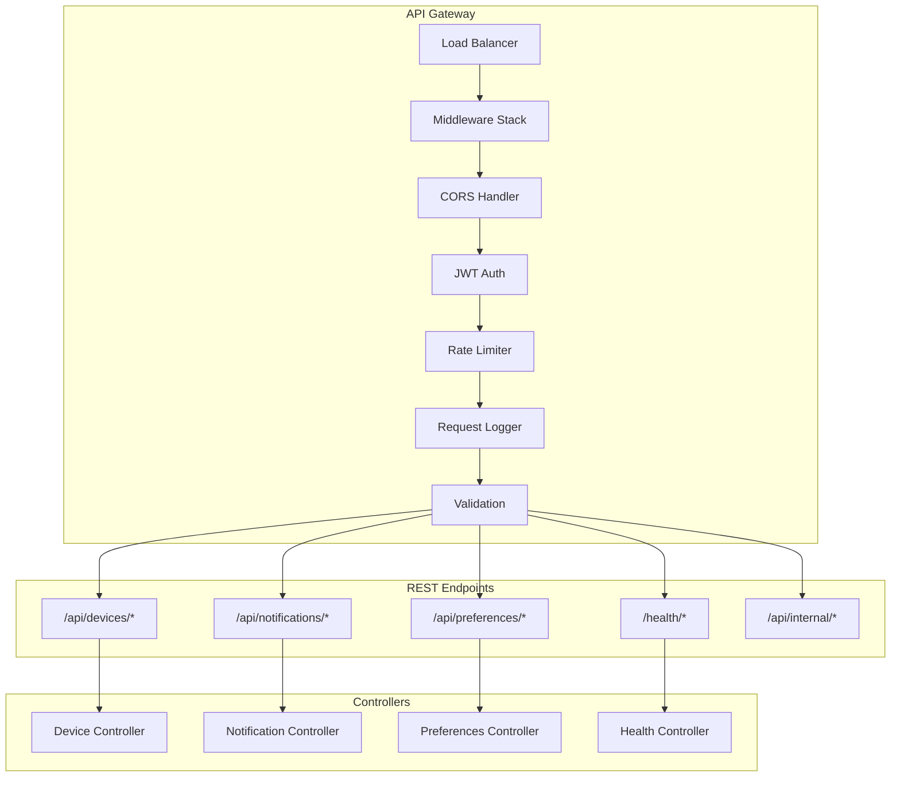
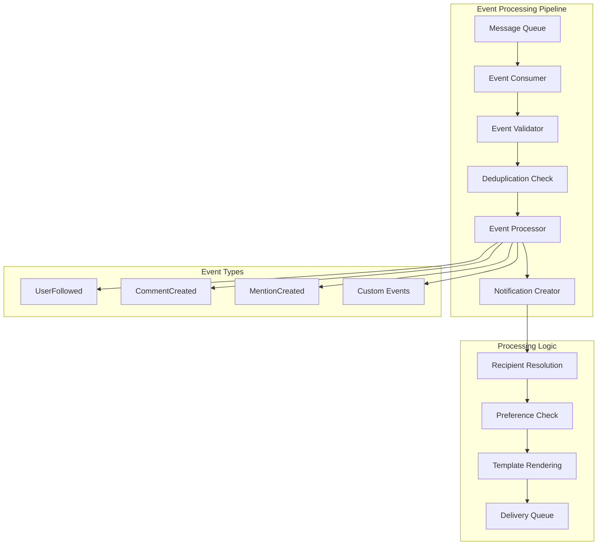
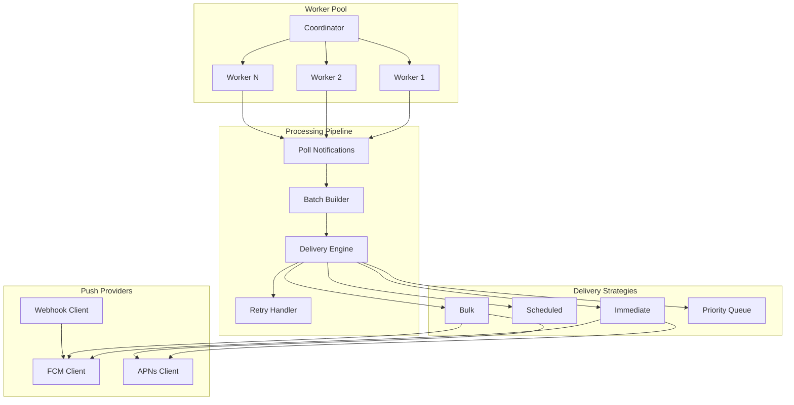
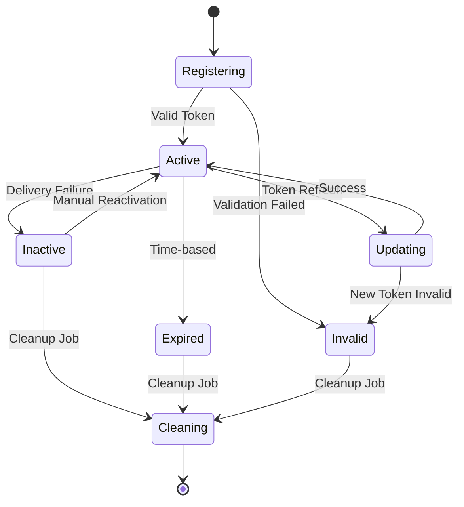

# Component Architecture

## 1. API Gateway Layer



### API Endpoints Specification

#### Device Management
```typescript
POST   /api/devices/register     // Register device token
PUT    /api/devices/:id         // Update device settings
DELETE /api/devices/:id         // Unregister device
GET    /api/devices/user/:userId // List user devices
PATCH  /api/devices/:id/settings // Update push settings
```

#### Notification Management
```typescript
POST   /api/notifications/send        // Send immediate notification
POST   /api/notifications/schedule    // Schedule notification
GET    /api/notifications/user/:userId // Get user inbox
PUT    /api/notifications/:id/read    // Mark as read
DELETE /api/notifications/:id         // Delete notification
GET    /api/notifications/:id         // Get notification details
POST   /api/notifications/bulk       // Bulk operations
```

#### User Preferences
```typescript
GET    /api/preferences/user/:userId   // Get preferences
PUT    /api/preferences/user/:userId   // Update preferences
PATCH  /api/preferences/user/:userId/category/:category // Update category
POST   /api/preferences/user/:userId/block    // Block keyword/source
DELETE /api/preferences/user/:userId/block/:id // Unblock
```

#### Health & Admin
```typescript
GET    /health                    // Basic health check
GET    /health/detailed          // Detailed system status
GET    /health/ready             // Kubernetes readiness
GET    /health/live              // Kubernetes liveness
POST   /api/internal/cleanup     // Manual cleanup trigger
GET    /api/internal/metrics     // Internal metrics
```

## 2. Event Consumer Architecture



### Idempotency Implementation

```typescript
class EventProcessor {
  async processEvent(event: NotificationEvent): Promise<void> {
    // 1. Validate event schema
    const validatedEvent = validateEvent(event);
    
    // 2. Check idempotency
    const eventKey = `event:${validatedEvent.eventId}`;
    const processed = await redis.exists(eventKey);
    
    if (processed) {
      logger.info('Event already processed', { eventId: validatedEvent.eventId });
      return;
    }
    
    // 3. Process event
    const notification = await this.createNotification(validatedEvent);
    
    // 4. Mark as processed (7-day TTL)
    await redis.setex(eventKey, 7 * 24 * 60 * 60, JSON.stringify({
      eventId: validatedEvent.eventId,
      notificationId: notification.notificationId,
      processedAt: new Date().toISOString(),
    }));
  }
}
```

## 3. Delivery Worker Architecture



### Batching & Retry Logic

```typescript
class DeliveryWorker {
  private readonly batchSize = 100;
  private readonly maxRetries = 3;
  private readonly retryDelays = [1000, 5000, 15000]; // ms

  async processBatch(): Promise<void> {
    // 1. Poll for pending notifications
    const notifications = await this.pollNotifications(this.batchSize);
    
    if (notifications.length === 0) {
      await this.sleep(1000); // Poll interval
      return;
    }

    // 2. Group by platform
    const androidNotifications = notifications.filter(n => n.platform === 'android');
    const iosNotifications = notifications.filter(n => n.platform === 'ios');

    // 3. Send batches with retry logic
    await Promise.all([
      this.sendWithRetry(androidNotifications, 'fcm'),
      this.sendWithRetry(iosNotifications, 'apns'),
    ]);
  }

  private async sendWithRetry(notifications: Notification[], provider: string): Promise<void> {
    for (let attempt = 0; attempt < this.maxRetries; attempt++) {
      try {
        await this.deliveryService.send(notifications, provider);
        return; // Success
      } catch (error) {
        if (attempt === this.maxRetries - 1) {
          // Final failure - send to DLQ
          await this.sendToDeadLetterQueue(notifications, error);
        } else {
          // Wait before retry with exponential backoff
          await this.sleep(this.retryDelays[attempt] * Math.pow(2, attempt));
        }
      }
    }
  }
}
```

## 4. Token Lifecycle Manager



### Token Management Logic

```typescript
class TokenLifecycleManager {
  async validateToken(token: string, platform: 'android' | 'ios'): Promise<boolean> {
    // Platform-specific validation
    if (platform === 'android') {
      return this.validateFCMToken(token);
    } else {
      return this.validateAPNsToken(token);
    }
  }

  async cleanupInactiveTokens(): Promise<void> {
    const cutoffDate = new Date(Date.now() - 30 * 24 * 60 * 60 * 1000); // 30 days
    
    // Find devices with delivery failures or inactive for 30+ days
    const inactiveDevices = await Device.find({
      $or: [
        { failureCount: { $gte: 5 } },
        { lastSeen: { $lt: cutoffDate } },
        { isActive: false }
      ]
    });

    // Batch delete inactive tokens
    const batchSize = 100;
    for (let i = 0; i < inactiveDevices.length; i += batchSize) {
      const batch = inactiveDevices.slice(i, i + batchSize);
      await Device.deleteMany({ _id: { $in: batch.map(d => d._id) } });
      
      logger.info('Cleaned up inactive tokens', { 
        count: batch.length,
        totalProcessed: i + batch.length 
      });
    }
  }
}
```

## 5. Database Schema Design

### MongoDB Collections

```typescript
// devices collection
{
  _id: ObjectId,
  userId: string (indexed),
  deviceToken: string (unique indexed),
  platform: 'android' | 'ios',
  appVersion: string,
  deviceInfo: {
    model: string,
    osVersion: string,
    manufacturer?: string,
    locale?: string,
    timezone?: string
  },
  isActive: boolean (indexed),
  lastSeen: Date (indexed),
  registrationDate: Date,
  pushSettings: {
    enabled: boolean,
    sound: boolean,
    badge: boolean,
    alert: boolean
  },
  failureCount: number,
  lastFailure?: Date,
  tags: [string] (indexed),
  metadata: object,
  createdAt: Date,
  updatedAt: Date
}

// notifications collection
{
  _id: ObjectId,
  notificationId: string (unique indexed),
  userId: string (indexed),
  title: string,
  body: string,
  category: string (indexed),
  priority: 'low'|'normal'|'high'|'critical' (indexed),
  data?: object,
  imageUrl?: string,
  scheduleAt?: Date (indexed),
  status: 'pending'|'scheduled'|'sent'|'delivered'|'failed' (indexed),
  isRead: boolean (indexed),
  readAt?: Date,
  delivery: {
    attempts: number,
    lastAttempt?: Date,
    devices: [{
      deviceId: string,
      platform: 'android'|'ios',
      status: 'pending'|'sent'|'delivered'|'failed',
      sentAt?: Date,
      deliveredAt?: Date,
      errorMessage?: string,
      fcmMessageId?: string,
      apnsId?: string
    }]
  },
  interactions: [{
    type: 'opened'|'clicked'|'dismissed',
    timestamp: Date,
    deviceId?: string,
    metadata?: object
  }],
  expiresAt?: Date (TTL indexed),
  source: string (indexed),
  campaign?: string (indexed),
  metadata: object,
  createdAt: Date (indexed),
  updatedAt: Date
}

// user_preferences collection
{
  _id: ObjectId,
  userId: string (unique indexed),
  globalSettings: {
    enabled: boolean,
    quietHours: {
      enabled: boolean,
      startTime: string, // HH:mm
      endTime: string,   // HH:mm
      timezone: string
    },
    frequency: 'immediate'|'batched'|'daily_digest',
    batchInterval: number
  },
  categories: object, // Dynamic category preferences
  platforms: {
    android: { enabled: boolean, channels: object },
    ios: { enabled: boolean, badge: boolean, sound: boolean }
  },
  blocked: {
    keywords: [string],
    sources: [string],
    senders: [string]
  },
  lastUpdated: Date,
  version: number,
  createdAt: Date,
  updatedAt: Date
}
```

### Index Strategy

```javascript
// Compound indexes for common queries
db.devices.createIndex({ "userId": 1, "isActive": 1 });
db.devices.createIndex({ "userId": 1, "platform": 1 });
db.devices.createIndex({ "lastSeen": 1 }); // For cleanup

db.notifications.createIndex({ "userId": 1, "createdAt": -1 });
db.notifications.createIndex({ "userId": 1, "isRead": 1 });
db.notifications.createIndex({ "status": 1, "scheduleAt": 1 }); // For scheduler
db.notifications.createIndex({ "category": 1, "createdAt": -1 });
db.notifications.createIndex({ "source": 1, "createdAt": -1 });

// TTL index for automatic cleanup
db.notifications.createIndex({ "expiresAt": 1 }, { expireAfterSeconds: 0 });

// Text search for notification content
db.notifications.createIndex({ 
  "title": "text", 
  "body": "text" 
}, { 
  weights: { "title": 10, "body": 5 },
  name: "notification_text_search" 
});
```

## 6. Error Handling & Circuit Breakers

```typescript
class CircuitBreaker {
  private failureCount = 0;
  private lastFailureTime?: Date;
  private state: 'CLOSED' | 'OPEN' | 'HALF_OPEN' = 'CLOSED';
  
  constructor(
    private readonly failureThreshold = 5,
    private readonly recoveryTimeout = 30000 // 30 seconds
  ) {}

  async execute<T>(operation: () => Promise<T>): Promise<T> {
    if (this.state === 'OPEN') {
      if (this.shouldAttemptReset()) {
        this.state = 'HALF_OPEN';
      } else {
        throw new Error('Circuit breaker is OPEN');
      }
    }

    try {
      const result = await operation();
      this.onSuccess();
      return result;
    } catch (error) {
      this.onFailure();
      throw error;
    }
  }

  private onSuccess(): void {
    this.failureCount = 0;
    this.state = 'CLOSED';
  }

  private onFailure(): void {
    this.failureCount++;
    this.lastFailureTime = new Date();
    
    if (this.failureCount >= this.failureThreshold) {
      this.state = 'OPEN';
    }
  }

  private shouldAttemptReset(): boolean {
    return this.lastFailureTime && 
           Date.now() - this.lastFailureTime.getTime() >= this.recoveryTimeout;
  }
}
```