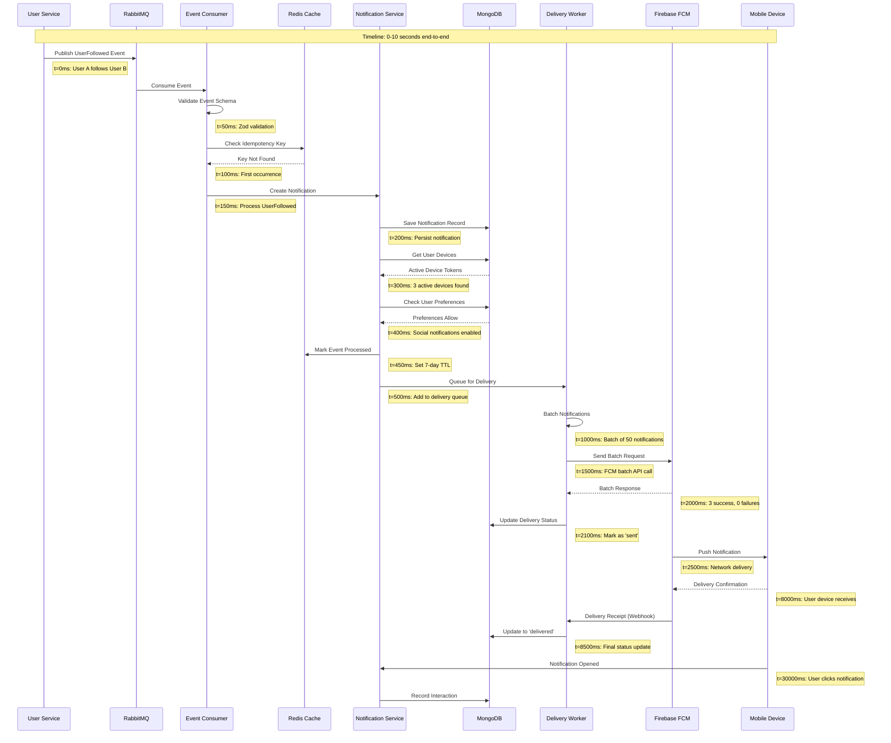
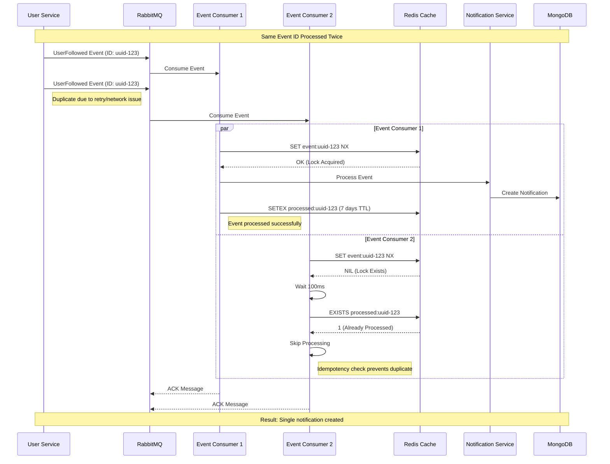
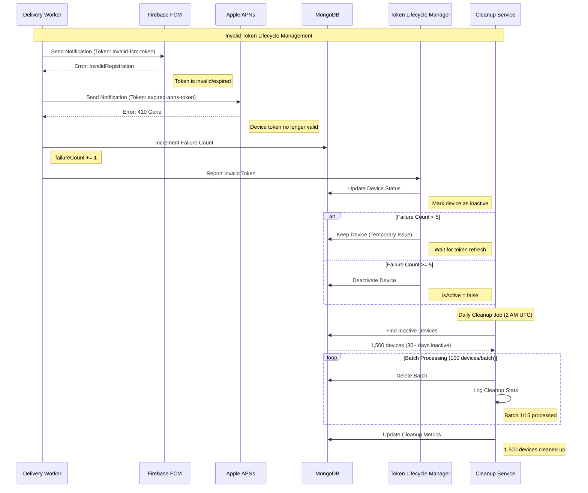
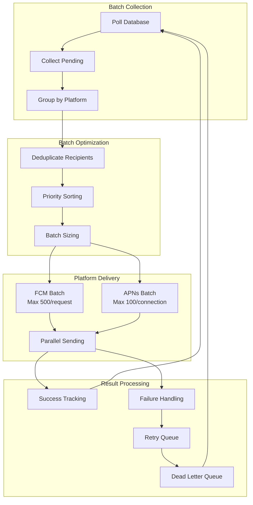
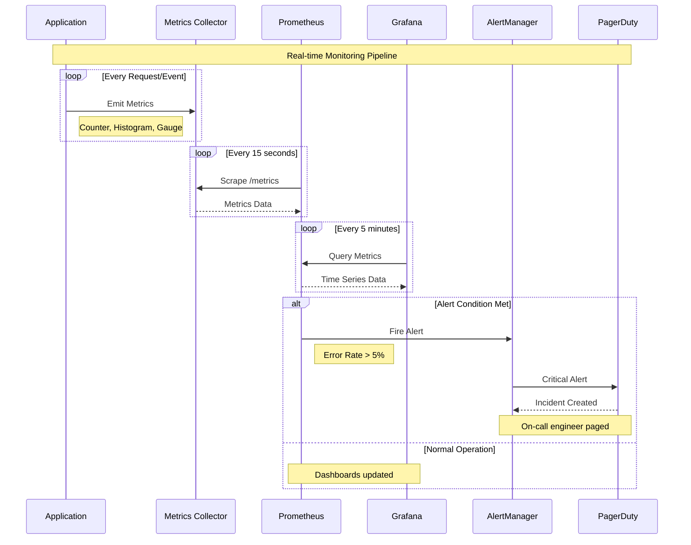

# Data Flow Diagrams

## 1. Happy Path: Follow Event → Notification → Push



### Performance Breakdown
| Phase | Duration | Components | Key Operations |
|-------|----------|------------|----------------|
| **Event Ingestion** | 0-100ms | RabbitMQ → Consumer | Message routing, consumption |
| **Event Validation** | 50-150ms | Event Consumer | Schema validation, idempotency check |
| **Notification Creation** | 150-500ms | Notification Service | DB queries, preference checks |
| **Delivery Queuing** | 500-1000ms | Delivery Worker | Batching, queue management |
| **Push Transmission** | 1.5-3s | FCM/APNs | External API calls |
| **Device Delivery** | 3-10s | Mobile Network | Network latency, device processing |

## 2. Duplicate Event Handling (Idempotency)



### Idempotency Implementation Details

```typescript
// Redis-based distributed locking for idempotency
class IdempotencyHandler {
  async processWithIdempotency(eventId: string, processor: () => Promise<void>): Promise<boolean> {
    const lockKey = `lock:event:${eventId}`;
    const processedKey = `processed:event:${eventId}`;
    
    // 1. Try to acquire processing lock (30 second TTL)
    const lockAcquired = await redis.set(lockKey, Date.now(), 'PX', 30000, 'NX');
    
    if (!lockAcquired) {
      // Another instance is processing, wait and check if completed
      await this.waitForCompletion(processedKey);
      return false; // Event processed by another instance
    }
    
    try {
      // 2. Check if already processed
      const alreadyProcessed = await redis.exists(processedKey);
      if (alreadyProcessed) {
        return false;
      }
      
      // 3. Process the event
      await processor();
      
      // 4. Mark as processed (7-day retention)
      await redis.setex(processedKey, 7 * 24 * 60 * 60, JSON.stringify({
        eventId,
        processedAt: new Date().toISOString(),
        processedBy: process.env.HOSTNAME || 'unknown'
      }));
      
      return true; // Successfully processed
      
    } finally {
      // 5. Release lock
      await redis.del(lockKey);
    }
  }
}
```

## 3. Invalid Token Detection & Cleanup Flow



### Token Validation Logic

```typescript
class TokenValidator {
  async handleDeliveryError(deviceId: string, error: PushError): Promise<void> {
    const device = await Device.findById(deviceId);
    if (!device) return;
    
    // Categorize error types
    const isTokenInvalid = this.isTokenInvalidError(error);
    const isTemporary = this.isTemporaryError(error);
    
    if (isTokenInvalid) {
      // Immediately deactivate invalid tokens
      device.isActive = false;
      device.failureCount = 10; // Mark for cleanup
      device.lastFailure = new Date();
      
      logger.warn('Invalid token detected', {
        deviceId: device._id,
        userId: device.userId,
        platform: device.platform,
        errorCode: error.code
      });
      
    } else if (isTemporary) {
      // Increment failure count for temporary issues
      device.failureCount += 1;
      device.lastFailure = new Date();
      
      // Deactivate after 5 consecutive failures
      if (device.failureCount >= 5) {
        device.isActive = false;
      }
      
    } else {
      // Unknown error - treat as temporary
      device.failureCount += 1;
    }
    
    await device.save();
  }
  
  private isTokenInvalidError(error: PushError): boolean {
    const invalidCodes = [
      'messaging/registration-token-not-registered',
      'messaging/invalid-registration-token',
      'BadDeviceToken',
      'Unregistered',
      'DeviceTokenNotForTopic'
    ];
    
    return invalidCodes.includes(error.code) || 
           error.statusCode === 410; // APNs Gone
  }
  
  private isTemporaryError(error: PushError): boolean {
    const temporaryCodes = [
      'messaging/server-unavailable',
      'messaging/internal-error',
      'ServiceUnavailable',
      'TooManyRequests'
    ];
    
    return temporaryCodes.includes(error.code) ||
           error.statusCode === 429 || // Rate limited
           error.statusCode === 503;   // Service unavailable
  }
}
```

## 4. Batch Processing & Delivery Optimization



### Batch Processing Implementation

```typescript
class BatchProcessor {
  private readonly FCM_BATCH_SIZE = 500;
  private readonly APNS_BATCH_SIZE = 100;
  private readonly MAX_CONCURRENT_BATCHES = 10;
  
  async processBatch(): Promise<void> {
    // 1. Collect pending notifications
    const pending = await this.collectPendingNotifications(1000);
    if (pending.length === 0) return;
    
    // 2. Group and optimize
    const optimized = this.optimizeBatch(pending);
    
    // 3. Create platform-specific batches
    const fcmBatches = this.createBatches(optimized.fcm, this.FCM_BATCH_SIZE);
    const apnsBatches = this.createBatches(optimized.apns, this.APNS_BATCH_SIZE);
    
    // 4. Process batches concurrently with limit
    await this.processConcurrentBatches([
      ...fcmBatches.map(batch => () => this.sendFCMBatch(batch)),
      ...apnsBatches.map(batch => () => this.sendAPNsBatch(batch))
    ]);
  }
  
  private optimizeBatch(notifications: Notification[]): OptimizedBatch {
    const grouped = this.groupByPlatform(notifications);
    
    return {
      fcm: this.deduplicateAndPrioritize(grouped.android),
      apns: this.deduplicateAndPrioritize(grouped.ios)
    };
  }
  
  private async processConcurrentBatches(batches: (() => Promise<void>)[]): Promise<void> {
    // Process batches with concurrency limit
    for (let i = 0; i < batches.length; i += this.MAX_CONCURRENT_BATCHES) {
      const chunk = batches.slice(i, i + this.MAX_CONCURRENT_BATCHES);
      await Promise.all(chunk.map(batch => batch()));
    }
  }
}
```

## 5. Real-time Metrics & Monitoring Flow



### Key Metrics Tracked

```typescript
// Prometheus metrics definitions
const metrics = {
  // Counters
  notificationsSent: new Counter({
    name: 'notifications_sent_total',
    help: 'Total number of notifications sent',
    labelNames: ['platform', 'status', 'priority']
  }),
  
  eventsProcessed: new Counter({
    name: 'events_processed_total', 
    help: 'Total events processed',
    labelNames: ['event_type', 'status']
  }),
  
  // Histograms
  deliveryLatency: new Histogram({
    name: 'notification_delivery_duration_seconds',
    help: 'Time from event to delivery',
    buckets: [0.1, 0.5, 1, 2, 5, 10, 30, 60]
  }),
  
  // Gauges
  queueDepth: new Gauge({
    name: 'notification_queue_depth',
    help: 'Current queue depth',
    labelNames: ['queue_type']
  }),
  
  activeDevices: new Gauge({
    name: 'devices_active_count',
    help: 'Number of active devices',
    labelNames: ['platform']
  })
};
```