# Scaling Strategy

## 1. Horizontal Scaling Architecture


### Scaling Trigger Matrix

| Metric | Scale Up Threshold | Scale Down Threshold | Scale Up Policy | Scale Down Policy |
|--------|-------------------|---------------------|-----------------|-------------------|
| **CPU Utilization** | > 70% for 2 minutes | < 30% for 5 minutes | +50% pods (max +2) | -10% pods every 5 minutes |
| **Memory Utilization** | > 80% for 1 minute | < 40% for 5 minutes | +100% pods (max +3) | -20% pods every 10 minutes |
| **Request Rate** | > 100 RPS/pod for 1 minute | < 30 RPS/pod for 10 minutes | +2 pods every 30 seconds | -1 pod every 5 minutes |
| **Queue Depth** | > 100 messages/pod | < 20 messages/pod | +50% pods immediately | -25% pods after 5 minutes |
| **Response Time** | > 500ms P95 for 2 minutes | < 100ms P95 for 10 minutes | +1 pod every minute | -1 pod every 10 minutes |

## 2. Vertical Scaling Configuration

### Resource Request & Limits

```yaml
# Resource configurations per service type
apiVersion: v1
kind: ConfigMap
metadata:
  name: resource-templates
data:
  api-resources.yaml: |
    # API Service Resources
    requests:
      cpu: "250m"      # 0.25 CPU cores
      memory: "512Mi"   # 512 MB RAM
    limits:
      cpu: "1"          # 1 CPU core
      memory: "2Gi"     # 2 GB RAM
    
  consumer-resources.yaml: |
    # Event Consumer Resources
    requests:
      cpu: "200m"      # 0.2 CPU cores
      memory: "256Mi"   # 256 MB RAM
    limits:
      cpu: "800m"      # 0.8 CPU cores
      memory: "1Gi"     # 1 GB RAM
    
  worker-resources.yaml: |
    # Delivery Worker Resources
    requests:
      cpu: "300m"      # 0.3 CPU cores
      memory: "512Mi"   # 512 MB RAM
    limits:
      cpu: "1.5"       # 1.5 CPU cores
      memory: "2Gi"     # 2 GB RAM
```

### Vertical Pod Autoscaler (VPA)

```yaml
# k8s/vpa.yaml
apiVersion: autoscaling.k8s.io/v1
kind: VerticalPodAutoscaler
metadata:
  name: notification-api-vpa
  namespace: notifications
spec:
  targetRef:
    apiVersion: apps/v1
    kind: Deployment
    name: notification-api
  updatePolicy:
    updateMode: "Auto"
  resourcePolicy:
    containerPolicies:
    - containerName: notification-api
      minAllowed:
        cpu: "100m"
        memory: "128Mi"
      maxAllowed:
        cpu: "2"
        memory: "4Gi"
      controlledResources: ["cpu", "memory"]
      controlledValues: RequestsAndLimits
---
apiVersion: autoscaling.k8s.io/v1
kind: VerticalPodAutoscaler
metadata:
  name: notification-worker-vpa
  namespace: notifications
spec:
  targetRef:
    apiVersion: apps/v1
    kind: Deployment
    name: notification-worker
  updatePolicy:
    updateMode: "Auto"
  resourcePolicy:
    containerPolicies:
    - containerName: notification-worker
      minAllowed:
        cpu: "200m"
        memory: "256Mi"
      maxAllowed:
        cpu: "3"
        memory: "6Gi"
      controlledResources: ["cpu", "memory"]
```

## 3. Database Scaling Strategy

### MongoDB Scaling Topology


### Sharding Configuration

```javascript
// MongoDB sharding setup
// Connect to mongos
use admin;

// Enable sharding for notifications database
sh.enableSharding("notifications");

// Shard collections based on access patterns

// 1. Devices collection - shard by userId (even distribution)
sh.shardCollection("notifications.devices", { "userId": 1 });

// 2. Notifications collection - shard by userId + createdAt (time-based queries)
sh.shardCollection("notifications.notifications", { 
  "userId": 1, 
  "createdAt": 1 
});

// 3. UserPreferences collection - shard by userId
sh.shardCollection("notifications.userpreferences", { "userId": 1 });

// 4. Analytics collection - shard by date (time-series data)
sh.shardCollection("notifications.analytics", { 
  "date": 1, 
  "eventType": 1 
});

// Configure balancer settings
sh.setBalancerState(true);
sh.startBalancer();

// Set chunk size (default 64MB, optimize for workload)
use config;
db.settings.save({ _id: "chunksize", value: 128 }); // 128MB chunks
```

### Redis Cluster Scaling

```yaml
# k8s/redis-cluster.yaml
apiVersion: apps/v1
kind: StatefulSet
metadata:
  name: redis-cluster
  namespace: notifications
spec:
  serviceName: redis-cluster
  replicas: 6  # 3 masters + 3 replicas
  template:
    spec:
      containers:
      - name: redis
        image: redis:7-alpine
        ports:
        - containerPort: 6379
        - containerPort: 16379  # Cluster bus port
        command:
        - redis-server
        - /etc/redis/redis.conf
        - --cluster-enabled yes
        - --cluster-config-file nodes.conf
        - --cluster-node-timeout 5000
        - --appendonly yes
        - --maxmemory 1gb
        - --maxmemory-policy allkeys-lru
        resources:
          requests:
            memory: "512Mi"
            cpu: "250m"
          limits:
            memory: "2Gi"
            cpu: "1"
        volumeMounts:
        - name: redis-data
          mountPath: /data
        - name: redis-config
          mountPath: /etc/redis
  volumeClaimTemplates:
  - metadata:
      name: redis-data
    spec:
      accessModes: ["ReadWriteOnce"]
      resources:
        requests:
          storage: 50Gi
```

## 4. Capacity Planning Model

### Traffic Capacity Calculator

```typescript
// Capacity planning model
class CapacityPlanner {
  private readonly SAFETY_FACTOR = 1.5; // 50% headroom
  private readonly PEAK_MULTIPLIER = 3;  // Peak is 3x average
  
  calculateRequiredCapacity(metrics: TrafficMetrics): CapacityPlan {
    const baselineRPS = metrics.averageRequestsPerSecond;
    const peakRPS = baselineRPS * this.PEAK_MULTIPLIER;
    const targetRPS = peakRPS * this.SAFETY_FACTOR;
    
    return {
      api: this.calculateAPICapacity(targetRPS),
      workers: this.calculateWorkerCapacity(metrics.notificationsPerSecond),
      database: this.calculateDBCapacity(metrics.dataGrowthGB),
      cache: this.calculateCacheCapacity(metrics.cacheHitRate)
    };
  }
  
  private calculateAPICapacity(targetRPS: number): ServiceCapacity {
    const RPS_PER_POD = 100; // Each API pod handles 100 RPS
    const requiredPods = Math.ceil(targetRPS / RPS_PER_POD);
    
    return {
      minPods: Math.max(3, Math.ceil(requiredPods * 0.3)),
      maxPods: Math.ceil(requiredPods * 1.2),
      targetPods: requiredPods,
      cpuPerPod: "500m",
      memoryPerPod: "1Gi"
    };
  }
  
  private calculateWorkerCapacity(notificationsPS: number): ServiceCapacity {
    const NOTIFICATIONS_PER_WORKER = 50; // Each worker processes 50 notifications/sec
    const requiredWorkers = Math.ceil(notificationsPS / NOTIFICATIONS_PER_WORKER);
    
    return {
      minPods: Math.max(5, Math.ceil(requiredWorkers * 0.4)),
      maxPods: Math.ceil(requiredWorkers * 1.5),
      targetPods: requiredWorkers,
      cpuPerPod: "800m",
      memoryPerPod: "1.5Gi"
    };
  }
  
  private calculateDBCapacity(dataGrowthGB: number): DatabaseCapacity {
    const MONTHLY_GROWTH = dataGrowthGB;
    const YEARLY_GROWTH = MONTHLY_GROWTH * 12;
    const WITH_INDEXES = YEARLY_GROWTH * 1.8; // Indexes add 80% overhead
    const WITH_REPLICATION = WITH_INDEXES * 3; // 1 primary + 2 secondaries
    
    return {
      storageGB: Math.ceil(WITH_REPLICATION * this.SAFETY_FACTOR),
      memoryGB: Math.ceil(YEARLY_GROWTH * 0.25), // Working set in memory
      shards: Math.ceil(YEARLY_GROWTH / 1000), // 1TB per shard
      replicas: 2 // Always have 2 replicas
    };
  }
}

// Example capacity calculation
const planner = new CapacityPlanner();
const currentMetrics: TrafficMetrics = {
  averageRequestsPerSecond: 1000,
  notificationsPerSecond: 500,
  dataGrowthGB: 10,
  cacheHitRate: 0.85
};

const capacity = planner.calculateRequiredCapacity(currentMetrics);
console.log('Required Capacity:', capacity);
```

### Traffic Pattern Analysis

```mermaid
gantt
    title Daily Traffic Patterns
    dateFormat  HH:mm
    axisFormat %H:%M
    
    section API Traffic
    Low Load (100 RPS)     :done, low1, 00:00, 06:00
    Morning Peak (800 RPS) :active, peak1, 06:00, 09:00
    Business Hours (1.2K RPS) :peak2, 09:00, 17:00
    Evening Peak (1.5K RPS)   :peak3, 17:00, 21:00
    Night Low (200 RPS)    :low2, 21:00, 24:00
    
    section Worker Load
    Overnight Processing   :done, work1, 00:00, 02:00
    Morning Digest (2K/s)  :active, work2, 07:00, 08:00
    Continuous (500/s)     :work3, 08:00, 18:00
    Evening Burst (3K/s)   :work4, 18:00, 19:00
    Cleanup (100/s)        :work5, 22:00, 24:00
```



### Auto-Scaling Policies

```yaml
# k8s/scaling-policies.yaml
apiVersion: v1
kind: ConfigMap
metadata:
  name: scaling-policies
  namespace: notifications
data:
  api-scaling.yaml: |
    # API Service Scaling Policy
    scaleUp:
      # Scale up quickly during traffic spikes
      stabilizationWindowSeconds: 60
      policies:
      - type: Percent
        value: 50    # Scale up by 50%
        periodSeconds: 15
      - type: Pods
        value: 2     # Or add 2 pods, whichever is higher
        periodSeconds: 15
    
    scaleDown:
      # Scale down slowly to avoid oscillation
      stabilizationWindowSeconds: 300
      policies:
      - type: Percent
        value: 10    # Scale down by 10%
        periodSeconds: 60
      - type: Pods
        value: 1     # Remove max 1 pod at a time
        periodSeconds: 60
        
  worker-scaling.yaml: |
    # Worker Service Scaling Policy
    scaleUp:
      # Aggressive scaling for queue backlog
      stabilizationWindowSeconds: 30
      policies:
      - type: Percent
        value: 100   # Double pods if needed
        periodSeconds: 30
      - type: Pods
        value: 3     # Add up to 3 pods immediately
        periodSeconds: 30
    
    scaleDown:
      # Conservative scale down to handle bursts
      stabilizationWindowSeconds: 600  # 10 minutes
      policies:
      - type: Percent
        value: 25    # Remove 25% of pods
        periodSeconds: 120
```

## 5. Cost Optimization Strategies

### Resource Right-Sizing

```typescript
// Cost optimization analyzer
class CostOptimizer {
  analyzePodUtilization(metrics: PodMetrics[]): OptimizationRecommendations {
    const recommendations: OptimizationRecommendations = {
      overProvisioned: [],
      underProvisioned: [],
      potentialSavings: 0
    };
    
    for (const metric of metrics) {
      const cpuUtil = metric.cpuUsage / metric.cpuRequests;
      const memUtil = metric.memoryUsage / metric.memoryRequests;
      
      // Flag over-provisioned pods (< 30% utilization)
      if (cpuUtil < 0.3 || memUtil < 0.3) {
        recommendations.overProvisioned.push({
          podName: metric.podName,
          currentRequests: {
            cpu: metric.cpuRequests,
            memory: metric.memoryRequests
          },
          recommendedRequests: {
            cpu: Math.max(metric.cpuUsage * 1.2, '100m'),
            memory: Math.max(metric.memoryUsage * 1.2, '128Mi')
          },
          monthlySavings: this.calculateSavings(metric)
        });
      }
      
      // Flag under-provisioned pods (> 80% utilization)
      if (cpuUtil > 0.8 || memUtil > 0.8) {
        recommendations.underProvisioned.push({
          podName: metric.podName,
          issue: cpuUtil > 0.8 ? 'CPU' : 'Memory',
          currentUtilization: Math.max(cpuUtil, memUtil),
          recommendedIncrease: '50%'
        });
      }
    }
    
    return recommendations;
  }
  
  private calculateSavings(metric: PodMetrics): number {
    // AWS EKS pricing: ~$0.048 per vCPU hour, ~$0.0051 per GB hour
    const cpuSavingsPerHour = (metric.cpuRequests - metric.cpuUsage * 1.2) * 0.048;
    const memorySavingsPerHour = (metric.memoryRequests - metric.memoryUsage * 1.2) * 0.0051;
    
    return (cpuSavingsPerHour + memorySavingsPerHour) * 24 * 30; // Monthly savings
  }
}
```

### Spot Instance Strategy

```yaml
# k8s/spot-node-pool.yaml
apiVersion: kops.k8s.io/v1alpha2
kind: InstanceGroup
metadata:
  name: spot-workers
spec:
  machineType: m5.xlarge
  maxSize: 20
  minSize: 5
  role: Node
  spot:
    maxPrice: "0.10"  # 50% of on-demand price
  mixedInstancesPolicy:
    instances:
    - m5.large
    - m5.xlarge
    - m4.large
    - m4.xlarge
    onDemandAboveBase: 2  # Keep 2 on-demand instances minimum
    spotInstancePools: 4   # Spread across 4 different instance types
  nodeLabels:
    node-type: "spot"
    workload-type: "batch"
  taints:
  - key: "spot-instance"
    value: "true"
    effect: "NoSchedule"
```

### Scheduled Scaling

```yaml
# Predictive scaling based on historical patterns
apiVersion: v1
kind: CronJob
metadata:
  name: morning-scale-up
  namespace: notifications
spec:
  schedule: "0 6 * * *"  # 6 AM daily
  jobTemplate:
    spec:
      template:
        spec:
          containers:
          - name: kubectl
            image: bitnami/kubectl:latest
            command:
            - /bin/sh
            - -c
            - |
              kubectl patch deployment notification-api -n notifications -p \
                '{"spec":{"replicas":8}}'
              kubectl patch deployment notification-worker -n notifications -p \
                '{"spec":{"replicas":12}}'
          restartPolicy: OnFailure
---
apiVersion: v1
kind: CronJob
metadata:
  name: night-scale-down
  namespace: notifications
spec:
  schedule: "0 23 * * *"  # 11 PM daily
  jobTemplate:
    spec:
      template:
        spec:
          containers:
          - name: kubectl
            image: bitnami/kubectl:latest
            command:
            - /bin/sh
            - -c
            - |
              kubectl patch deployment notification-api -n notifications -p \
                '{"spec":{"replicas":4}}'
              kubectl patch deployment notification-worker -n notifications -p \
                '{"spec":{"replicas":6}}'
          restartPolicy: OnFailure
```