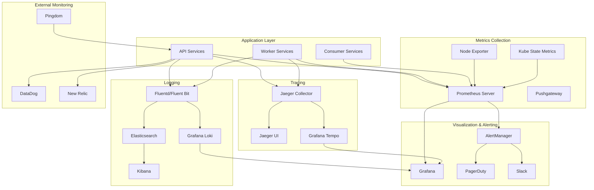

# Monitoring & Observability

## 1. Monitoring Stack Architecture



## 2. Key Performance Indicators (KPIs)

### Business Metrics

```typescript
// Business KPI definitions
interface BusinessKPIs {
  // Delivery Success
  notificationDeliveryRate: number;     // Target: > 95%
  notificationDeliveryTime: number;     // Target: < 30 seconds P95
  pushNotificationOpenRate: number;     // Target: > 15%
  
  // User Engagement
  activeDevicesCount: number;           // Growing user base
  notificationOptInRate: number;        // Target: > 80%
  unsubscribeRate: number;             // Target: < 5%
  
  // System Performance
  endToEndLatency: number;             // Target: < 10 seconds P99
  systemAvailability: number;          // Target: 99.9%
  errorRate: number;                   // Target: < 1%
  
  // Cost Efficiency
  costPerNotification: number;         // Optimize over time
  infrastructureCostTrend: number;     // Should scale with usage
}

// Prometheus metrics for business KPIs
const businessMetrics = {
  deliverySuccess: new Counter({
    name: 'notifications_delivered_total',
    help: 'Total notifications successfully delivered',
    labelNames: ['platform', 'notification_type', 'user_segment']
  }),
  
  deliveryLatency: new Histogram({
    name: 'notification_end_to_end_duration_seconds',
    help: 'End-to-end notification delivery time',
    buckets: [1, 5, 10, 30, 60, 120, 300, 600],
    labelNames: ['platform', 'priority']
  }),
  
  userEngagement: new Counter({
    name: 'notification_interactions_total',
    help: 'User interactions with notifications',
    labelNames: ['action', 'notification_type', 'platform']
  }),
  
  deviceHealth: new Gauge({
    name: 'device_tokens_active_count',
    help: 'Number of active device tokens',
    labelNames: ['platform', 'app_version']
  })
};
```

### Technical Metrics

```yaml
# Prometheus recording rules for SLIs
apiVersion: monitoring.coreos.com/v1
kind: PrometheusRule
metadata:
  name: notification-sli-rules
  namespace: notifications
spec:
  groups:
  - name: notification.sli
    interval: 30s
    rules:
    # Availability SLI: Request success rate
    - record: notification:availability:rate5m
      expr: |
        (
          sum(rate(http_requests_total{job="notification-api", code!~"5.."}[5m]))
        /
          sum(rate(http_requests_total{job="notification-api"}[5m]))
        )
    
    # Latency SLI: P99 response time
    - record: notification:latency:p99_5m
      expr: |
        histogram_quantile(0.99,
          sum(rate(http_request_duration_seconds_bucket{job="notification-api"}[5m])) by (le)
        )
    
    # Throughput SLI: Requests per second
    - record: notification:throughput:rate5m
      expr: |
        sum(rate(http_requests_total{job="notification-api"}[5m]))
    
    # Delivery Success SLI
    - record: notification:delivery_success:rate5m
      expr: |
        (
          sum(rate(notifications_delivered_total{status="success"}[5m]))
        /
          sum(rate(notifications_delivered_total[5m]))
        )
    
    # Queue Health SLI
    - record: notification:queue_health:depth
      expr: |
        sum(rabbitmq_queue_messages{queue=~"notification.*"})
    
    # Error Budget Burn Rate
    - record: notification:error_budget_burn_rate:5m
      expr: |
        1 - notification:availability:rate5m
```

### Custom Application Metrics

```typescript
// Application-specific metrics instrumentation
class NotificationMetrics {
  private readonly metrics = {
    // Event processing metrics
    eventsReceived: new Counter({
      name: 'events_received_total',
      help: 'Total events received from message queue',
      labelNames: ['event_type', 'source_service']
    }),
    
    eventsProcessed: new Counter({
      name: 'events_processed_total',
      help: 'Total events successfully processed',
      labelNames: ['event_type', 'outcome']
    }),
    
    // Notification lifecycle metrics
    notificationCreated: new Counter({
      name: 'notifications_created_total',
      help: 'Notifications created in database',
      labelNames: ['type', 'priority', 'target_platform']
    }),
    
    notificationDelivery: new Histogram({
      name: 'notification_delivery_duration_seconds',
      help: 'Time from creation to delivery attempt',
      buckets: [0.1, 0.5, 1, 2, 5, 10, 30, 60, 300],
      labelNames: ['platform', 'batch_size']
    }),
    
    // External service metrics
    fcmRequests: new Counter({
      name: 'fcm_requests_total',
      help: 'Requests made to FCM service',
      labelNames: ['status', 'error_code']
    }),
    
    apnsRequests: new Counter({
      name: 'apns_requests_total',
      help: 'Requests made to APNs service',
      labelNames: ['status', 'error_code']
    }),
    
    // Device token health
    deviceTokenInvalidated: new Counter({
      name: 'device_tokens_invalidated_total',
      help: 'Device tokens marked as invalid',
      labelNames: ['platform', 'reason']
    }),
    
    // Cache performance
    cacheOperations: new Counter({
      name: 'cache_operations_total',
      help: 'Cache operations performed',
      labelNames: ['operation', 'result']
    })
  };
  
  recordEventReceived(eventType: string, sourceService: string): void {
    this.metrics.eventsReceived.inc({ event_type: eventType, source_service: sourceService });
  }
  
  recordNotificationDelivery(platform: string, duration: number, batchSize: number): void {
    this.metrics.notificationDelivery.observe(
      { platform, batch_size: batchSize.toString() },
      duration
    );
  }
  
  recordExternalServiceCall(service: 'fcm' | 'apns', status: string, errorCode?: string): void {
    if (service === 'fcm') {
      this.metrics.fcmRequests.inc({ status, error_code: errorCode || 'none' });
    } else {
      this.metrics.apnsRequests.inc({ status, error_code: errorCode || 'none' });
    }
  }
}

// Middleware to automatically track HTTP metrics
class HTTPMetricsMiddleware {
  private readonly httpDuration = new Histogram({
    name: 'http_request_duration_seconds',
    help: 'HTTP request duration in seconds',
    buckets: [0.005, 0.01, 0.025, 0.05, 0.1, 0.25, 0.5, 1, 2.5, 5, 10],
    labelNames: ['method', 'route', 'status_code']
  });
  
  private readonly httpRequests = new Counter({
    name: 'http_requests_total',
    help: 'Total HTTP requests',
    labelNames: ['method', 'route', 'status_code']
  });
  
  middleware() {
    return (req: Request, res: Response, next: NextFunction) => {
      const start = Date.now();
      
      res.on('finish', () => {
        const duration = (Date.now() - start) / 1000;
        const labels = {
          method: req.method,
          route: req.route?.path || req.path,
          status_code: res.statusCode.toString()
        };
        
        this.httpDuration.observe(labels, duration);
        this.httpRequests.inc(labels);
      });
      
      next();
    };
  }
}
```

## 3. Grafana Dashboard Configuration

### System Overview Dashboard

```json
{
  "dashboard": {
    "title": "Notification Service - System Overview",
    "panels": [
      {
        "title": "Service Health",
        "type": "stat",
        "targets": [
          {
            "expr": "notification:availability:rate5m * 100",
            "legendFormat": "Availability %",
            "refId": "A"
          },
          {
            "expr": "notification:delivery_success:rate5m * 100",
            "legendFormat": "Delivery Success %",
            "refId": "B"
          }
        ],
        "fieldConfig": {
          "defaults": {
            "unit": "percent",
            "thresholds": {
              "steps": [
                { "color": "red", "value": 0 },
                { "color": "yellow", "value": 95 },
                { "color": "green", "value": 99 }
              ]
            }
          }
        }
      },
      {
        "title": "Request Rate & Latency",
        "type": "graph",
        "targets": [
          {
            "expr": "notification:throughput:rate5m",
            "legendFormat": "Requests/sec",
            "yAxis": 1
          },
          {
            "expr": "notification:latency:p99_5m * 1000",
            "legendFormat": "P99 Latency (ms)",
            "yAxis": 2
          }
        ],
        "yAxes": [
          { "label": "Requests/sec", "min": 0 },
          { "label": "Milliseconds", "min": 0 }
        ]
      },
      {
        "title": "Error Rate",
        "type": "graph",
        "targets": [
          {
            "expr": "rate(http_requests_total{job=\"notification-api\", code=~\"5..\"}[5m])",
            "legendFormat": "5xx Errors/sec"
          },
          {
            "expr": "rate(http_requests_total{job=\"notification-api\", code=~\"4..\"}[5m])",
            "legendFormat": "4xx Errors/sec"
          }
        ],
        "alert": {
          "conditions": [
            {
              "query": { "queryType": "", "refId": "A" },
              "reducer": { "params": [], "type": "last" },
              "evaluator": { "params": [10], "type": "gt" }
            }
          ],
          "executionErrorState": "alerting",
          "for": "5m",
          "frequency": "10s",
          "handler": 1,
          "name": "High Error Rate",
          "noDataState": "no_data"
        }
      },
      {
        "title": "Queue Depth",
        "type": "graph",
        "targets": [
          {
            "expr": "notification:queue_health:depth",
            "legendFormat": "Messages in Queue"
          }
        ],
        "thresholds": [
          {
            "value": 1000,
            "colorMode": "critical",
            "op": "EVAL_GT"
          }
        ]
      }
    ]
  }
}
```

### Business Metrics Dashboard

```json
{
  "dashboard": {
    "title": "Notification Service - Business Metrics",
    "panels": [
      {
        "title": "Notification Volume",
        "type": "graph",
        "targets": [
          {
            "expr": "sum(rate(notifications_created_total[5m])) by (type)",
            "legendFormat": "{{type}}"
          }
        ],
        "stack": true
      },
      {
        "title": "Platform Distribution",
        "type": "piechart",
        "targets": [
          {
            "expr": "sum(notifications_delivered_total) by (platform)",
            "legendFormat": "{{platform}}"
          }
        ]
      },
      {
        "title": "Delivery Success by Platform",
        "type": "table",
        "targets": [
          {
            "expr": "sum(rate(notifications_delivered_total{status=\"success\"}[5m])) by (platform) / sum(rate(notifications_delivered_total[5m])) by (platform) * 100",
            "legendFormat": "{{platform}}"
          }
        ]
      },
      {
        "title": "User Engagement",
        "type": "stat",
        "targets": [
          {
            "expr": "sum(device_tokens_active_count)",
            "legendFormat": "Active Devices"
          },
          {
            "expr": "sum(rate(notification_interactions_total[24h])) / sum(rate(notifications_delivered_total[24h])) * 100",
            "legendFormat": "Interaction Rate %"
          }
        ]
      }
    ]
  }
}
```

## 4. Alerting Rules & Runbooks

### Critical Alerts

```yaml
# k8s/alert-rules.yaml
apiVersion: monitoring.coreos.com/v1
kind: PrometheusRule
metadata:
  name: notification-alerts
  namespace: notifications
spec:
  groups:
  - name: notification.critical
    rules:
    # Service Down
    - alert: NotificationServiceDown
      expr: up{job="notification-api"} == 0
      for: 1m
      labels:
        severity: critical
        service: notification-api
      annotations:
        summary: "Notification API service is down"
        description: "The notification API service has been down for more than 1 minute"
        runbook_url: "https://runbooks.company.com/notification-service-down"
    
    # High Error Rate
    - alert: NotificationHighErrorRate
      expr: notification:availability:rate5m < 0.95
      for: 5m
      labels:
        severity: critical
        service: notification-api
      annotations:
        summary: "High error rate detected"
        description: "Error rate is {{ $value | humanizePercentage }} for the last 5 minutes"
        runbook_url: "https://runbooks.company.com/high-error-rate"
    
    # Delivery Failure
    - alert: NotificationDeliveryFailure
      expr: notification:delivery_success:rate5m < 0.90
      for: 10m
      labels:
        severity: critical
        service: notification-delivery
      annotations:
        summary: "Notification delivery success rate too low"
        description: "Only {{ $value | humanizePercentage }} of notifications are being delivered successfully"
        runbook_url: "https://runbooks.company.com/delivery-failure"
    
    # Queue Backlog
    - alert: NotificationQueueBacklog
      expr: notification:queue_health:depth > 5000
      for: 15m
      labels:
        severity: critical
        service: notification-queue
      annotations:
        summary: "Large notification queue backlog"
        description: "{{ $value }} messages in notification queue for 15+ minutes"
        runbook_url: "https://runbooks.company.com/queue-backlog"
  
  - name: notification.warning
    rules:
    # High Latency
    - alert: NotificationHighLatency
      expr: notification:latency:p99_5m > 2
      for: 10m
      labels:
        severity: warning
        service: notification-api
      annotations:
        summary: "High latency detected"
        description: "P99 latency is {{ $value }}s for the last 10 minutes"
        runbook_url: "https://runbooks.company.com/high-latency"
    
    # FCM/APNs Errors
    - alert: PushServiceErrors
      expr: sum(rate(fcm_requests_total{status!="success"}[5m])) + sum(rate(apns_requests_total{status!="success"}[5m])) > 10
      for: 5m
      labels:
        severity: warning
        service: push-delivery
      annotations:
        summary: "Push service errors increasing"
        description: "{{ $value }} push service errors per second"
        runbook_url: "https://runbooks.company.com/push-service-errors"
    
    # Resource Usage
    - alert: HighMemoryUsage
      expr: container_memory_usage_bytes{pod=~"notification-.*"} / container_spec_memory_limit_bytes > 0.9
      for: 5m
      labels:
        severity: warning
        service: "{{ $labels.pod }}"
      annotations:
        summary: "High memory usage in {{ $labels.pod }}"
        description: "Memory usage is {{ $value | humanizePercentage }} of limit"
        runbook_url: "https://runbooks.company.com/high-memory-usage"
```

### Runbook Templates

```markdown
# Runbook: Notification Service Down

## Alert: NotificationServiceDown

### Symptoms
- API health checks failing
- No HTTP traffic to notification service
- Users cannot register devices or receive notifications

### Investigation Steps

1. **Check Pod Status**
   ```bash
   kubectl get pods -n notifications -l app=notification-api
   kubectl describe pod <failing-pod> -n notifications
   ```

2. **Check Service Logs**
   ```bash
   kubectl logs -f deployment/notification-api -n notifications --tail=100
   ```

3. **Check Dependencies**
   ```bash
   # MongoDB connectivity
   kubectl exec -it <pod-name> -n notifications -- mongo $MONGODB_URI --eval "db.runCommand('ping')"
   
   # Redis connectivity  
   kubectl exec -it <pod-name> -n notifications -- redis-cli -u $REDIS_URL ping
   
   # RabbitMQ connectivity
   kubectl exec -it <pod-name> -n notifications -- curl -f $RABBITMQ_MANAGEMENT_URL/api/overview
   ```

### Common Solutions

1. **Database Connection Issues**
   - Check MongoDB cluster health
   - Verify connection string and credentials
   - Scale MongoDB if resource constrained

2. **Resource Exhaustion**
   ```bash
   # Check resource usage
   kubectl top pods -n notifications
   
   # Scale horizontally if needed
   kubectl scale deployment notification-api -n notifications --replicas=6
   ```

3. **Configuration Issues**
   - Verify ConfigMap and Secret values
   - Check environment variable injection
   - Restart pods to pick up configuration changes

### Escalation
- If issue persists > 15 minutes: Page on-call engineer
- If affects > 50% of users: Escalate to engineering manager
- If data loss risk: Contact database team immediately
```

## 5. Log Aggregation & Analysis

### Structured Logging Format

```typescript
// Structured logging implementation
class StructuredLogger {
  private winston: winston.Logger;
  
  constructor() {
    this.winston = winston.createLogger({
      level: process.env.LOG_LEVEL || 'info',
      format: winston.format.combine(
        winston.format.timestamp(),
        winston.format.errors({ stack: true }),
        winston.format.json(),
        winston.format.printf((info) => {
          return JSON.stringify({
            timestamp: info.timestamp,
            level: info.level,
            message: info.message,
            service: 'notification-service',
            version: process.env.APP_VERSION || '1.0.0',
            environment: process.env.NODE_ENV || 'development',
            traceId: info.traceId,
            spanId: info.spanId,
            userId: info.userId,
            deviceId: info.deviceId,
            notificationId: info.notificationId,
            ...info.metadata
          });
        })
      ),
      transports: [
        new winston.transports.Console(),
        new winston.transports.File({ filename: 'logs/error.log', level: 'error' }),
        new winston.transports.File({ filename: 'logs/combined.log' })
      ]
    });
  }
  
  info(message: string, metadata?: LogMetadata): void {
    this.winston.info(message, metadata);
  }
  
  error(message: string, error?: Error, metadata?: LogMetadata): void {
    this.winston.error(message, { 
      error: error?.message,
      stack: error?.stack,
      ...metadata 
    });
  }
  
  // Specific notification logging methods
  logNotificationCreated(notificationId: string, userId: string, type: string): void {
    this.info('Notification created', {
      notificationId,
      userId,
      type,
      event: 'notification_created'
    });
  }
  
  logDeliveryAttempt(notificationId: string, platform: string, deviceToken: string): void {
    this.info('Delivery attempt started', {
      notificationId,
      platform,
      deviceToken: this.maskToken(deviceToken),
      event: 'delivery_attempt'
    });
  }
  
  logDeliveryResult(notificationId: string, success: boolean, error?: string): void {
    if (success) {
      this.info('Delivery successful', {
        notificationId,
        event: 'delivery_success'
      });
    } else {
      this.error('Delivery failed', new Error(error), {
        notificationId,
        event: 'delivery_failure'
      });
    }
  }
  
  private maskToken(token: string): string {
    // Mask device token for privacy (show first 8 chars)
    return token.length > 8 ? `${token.substring(0, 8)}...` : token;
  }
}
```

### Log Analysis Queries

```yaml
# Grafana Loki queries for common investigations
queries:
  # Error rate trend
  error_rate: |
    sum(rate({service="notification-service"} |= "ERROR" [5m])) by (level)
  
  # Failed deliveries by platform
  failed_deliveries: |
    {service="notification-service"} 
    |= "delivery_failure" 
    | json 
    | __error__ = "" 
    | count by (platform)
  
  # Top error messages
  top_errors: |
    {service="notification-service"} 
    |= "ERROR" 
    | json 
    | topk(10, count by (message))
  
  # Slow requests (> 1s)
  slow_requests: |
    {service="notification-api"} 
    |= "HTTP" 
    | json 
    | duration > 1000 
    | sort by (duration) desc
  
  # User journey tracking
  user_journey: |
    {service="notification-service"} 
    |= "userId=\"12345\"" 
    | json 
    | sort by (timestamp) asc
```