# Security Considerations

## 1. Threat Model & Attack Vectors

```mermaid
graph TB
    subgraph "External Threats"
        DDOS["DDoS Attacks"]
        BRUTEFORCE["Brute Force"]
        INJECTION["Injection Attacks"]
        MITM["Man-in-the-Middle"]
    end
    
    subgraph "Application Layer Threats"
        AUTH["Authentication Bypass"]
        AUTHZ["Authorization Flaws"]
        DATAEXP["Data Exposure"]
        DESERIALIZATION["Unsafe Deserialization"]
    end
    
    subgraph "Infrastructure Threats"
        CONTAINER["Container Escapes"]
        SECRETS["Secret Exposure"]
        NETWORK["Network Intrusion"]
        SUPPLY["Supply Chain"]
    end
    
    subgraph "Data Threats"
        PII["PII Exposure"]
        TOKENS["Token Theft"]
        LOGS["Log Injection"]
        BACKUP["Backup Compromise"]
    end
    
    subgraph "Mitigation Controls"
        WAF["Web Application Firewall"]
        RATELIMIT["Rate Limiting"]
        ENCRYPTION["End-to-End Encryption"]
        RBAC["Role-Based Access"]
        AUDIT["Audit Logging"]
        SCANNING["Vulnerability Scanning"]
        SECRETS_MNG["Secrets Management"]
        NETWORK_POLICY["Network Policies"]
    end
    
    %% Threat-to-Control Mapping
    DDOS --> RATELIMIT
    DDOS --> WAF
    BRUTEFORCE --> RATELIMIT
    BRUTEFORCE --> RBAC
    INJECTION --> WAF
    INJECTION --> SCANNING
    MITM --> ENCRYPTION
    
    AUTH --> RBAC
    AUTH --> AUDIT
    AUTHZ --> RBAC
    DATAEXP --> ENCRYPTION
    DATAEXP --> AUDIT
    DESERIALIZATION --> SCANNING
    
    CONTAINER --> NETWORK_POLICY
    SECRETS --> SECRETS_MNG
    NETWORK --> NETWORK_POLICY
    SUPPLY --> SCANNING
    
    PII --> ENCRYPTION
    PII --> AUDIT
    TOKENS --> ENCRYPTION
    TOKENS --> SECRETS_MNG
    LOGS --> AUDIT
    BACKUP --> ENCRYPTION
```



### Risk Assessment Matrix

| Threat | Likelihood | Impact | Risk Level | Mitigation Status |
|--------|------------|--------|------------|-------------------|
| **DDoS Attack** | High | High | 🔴 Critical | ✅ WAF + Rate Limiting |
| **JWT Token Compromise** | Medium | High | 🟡 High | ✅ Short expiry + Refresh |
| **Database Injection** | Low | High | 🟡 High | ✅ Parameterized queries |
| **Device Token Theft** | Medium | Medium | 🟡 Medium | ⚠️ Encryption in transit |
| **Container Escape** | Low | High | 🟡 High | ✅ Security contexts |
| **Secrets in Logs** | Medium | Medium | 🟡 Medium | ✅ Log sanitization |
| **PII Data Breach** | Low | Critical | 🟡 High | ✅ Field-level encryption |
| **Supply Chain Attack** | Medium | High | 🟡 High | ⚠️ Dependency scanning |

## 2. Authentication & Authorization

### JWT Token Implementation

```typescript
// Secure JWT implementation with rotation
class JWTService {
  private readonly SECRET_ROTATION_HOURS = 24;
  private readonly ACCESS_TOKEN_EXPIRY = '15m';
  private readonly REFRESH_TOKEN_EXPIRY = '7d';
  
  constructor(
    private redis: RedisClient,
    private secretsManager: SecretsManager
  ) {}
  
  async generateTokenPair(userId: string, deviceId: string): Promise<TokenPair> {
    const payload: JWTPayload = {
      sub: userId,
      deviceId,
      iat: Math.floor(Date.now() / 1000),
      jti: uuidv4() // Unique token ID for blacklisting
    };
    
    const accessToken = await this.signToken(payload, this.ACCESS_TOKEN_EXPIRY);
    const refreshToken = await this.signToken(
      { ...payload, type: 'refresh' }, 
      this.REFRESH_TOKEN_EXPIRY
    );
    
    // Store refresh token with Redis expiration
    await this.redis.setex(
      `refresh:${userId}:${deviceId}`, 
      7 * 24 * 60 * 60, // 7 days
      refreshToken
    );
    
    return { accessToken, refreshToken };
  }
  
  async verifyToken(token: string): Promise<JWTPayload> {
    try {
      // Check if token is blacklisted
      const isBlacklisted = await this.redis.exists(`blacklist:${this.getTokenId(token)}`);
      if (isBlacklisted) {
        throw new UnauthorizedError('Token has been revoked');
      }
      
      // Verify with current and previous secrets (key rotation support)
      const currentSecret = await this.getCurrentSecret();
      const previousSecret = await this.getPreviousSecret();
      
      for (const secret of [currentSecret, previousSecret].filter(Boolean)) {
        try {
          return jwt.verify(token, secret, {
            algorithms: ['HS256'],
            issuer: 'notification-service',
            audience: 'notification-api'
          }) as JWTPayload;
        } catch (error) {
          // Try next secret
        }
      }
      
      throw new UnauthorizedError('Invalid token signature');
    } catch (error) {
      throw new UnauthorizedError('Token verification failed');
    }
  }
  
  async revokeToken(token: string): Promise<void> {
    const payload = await this.verifyToken(token);
    const expiresIn = payload.exp - Math.floor(Date.now() / 1000);
    
    if (expiresIn > 0) {
      // Add to blacklist until natural expiration
      await this.redis.setex(`blacklist:${payload.jti}`, expiresIn, '1');
    }
  }
  
  private async signToken(payload: JWTPayload, expiresIn: string): Promise<string> {
    const secret = await this.getCurrentSecret();
    
    return jwt.sign(payload, secret, {
      expiresIn,
      issuer: 'notification-service',
      audience: 'notification-api',
      algorithm: 'HS256'
    });
  }
  
  private async getCurrentSecret(): Promise<string> {
    const secretKey = `jwt-secret-${Math.floor(Date.now() / (this.SECRET_ROTATION_HOURS * 60 * 60 * 1000))}`;
    return await this.secretsManager.getSecret(secretKey);
  }
  
  private getTokenId(token: string): string {
    const decoded = jwt.decode(token) as JWTPayload;
    return decoded?.jti || '';
  }
}
```

### Role-Based Access Control (RBAC)

```typescript
// RBAC implementation
enum Permission {
  READ_NOTIFICATIONS = 'notifications:read',
  WRITE_NOTIFICATIONS = 'notifications:write',
  DELETE_NOTIFICATIONS = 'notifications:delete',
  MANAGE_DEVICES = 'devices:manage',
  READ_ANALYTICS = 'analytics:read',
  ADMIN_ACCESS = 'admin:access'
}

interface Role {
  name: string;
  permissions: Permission[];
  inherits?: string[]; // Role inheritance
}

class RBACService {
  private readonly roles: Map<string, Role> = new Map([
    ['user', {
      name: 'user',
      permissions: [
        Permission.READ_NOTIFICATIONS,
        Permission.WRITE_NOTIFICATIONS,
        Permission.MANAGE_DEVICES
      ]
    }],
    ['admin', {
      name: 'admin',
      permissions: [
        Permission.READ_ANALYTICS,
        Permission.DELETE_NOTIFICATIONS,
        Permission.ADMIN_ACCESS
      ],
      inherits: ['user'] // Admin inherits user permissions
    }],
    ['service', {
      name: 'service',
      permissions: [
        Permission.WRITE_NOTIFICATIONS,
        Permission.READ_NOTIFICATIONS
      ]
    }]
  ]);
  
  async checkPermission(userId: string, permission: Permission): Promise<boolean> {
    const userRoles = await this.getUserRoles(userId);
    const allPermissions = this.getAllPermissions(userRoles);
    
    return allPermissions.includes(permission);
  }
  
  private getAllPermissions(roleNames: string[]): Permission[] {
    const permissions = new Set<Permission>();
    const visited = new Set<string>();
    
    const collectPermissions = (roleName: string) => {
      if (visited.has(roleName)) return;
      visited.add(roleName);
      
      const role = this.roles.get(roleName);
      if (!role) return;
      
      // Add direct permissions
      role.permissions.forEach(p => permissions.add(p));
      
      // Add inherited permissions
      role.inherits?.forEach(inheritedRole => {
        collectPermissions(inheritedRole);
      });
    };
    
    roleNames.forEach(collectPermissions);
    return Array.from(permissions);
  }
  
  private async getUserRoles(userId: string): Promise<string[]> {
    // In production, fetch from database or external service
    // For now, simplified logic
    return userId.startsWith('admin_') ? ['admin'] : ['user'];
  }
}

// Authorization middleware
const authorize = (permission: Permission) => {
  return async (req: Request, res: Response, next: NextFunction) => {
    try {
      const token = req.headers.authorization?.replace('Bearer ', '');
      if (!token) {
        return res.status(401).json({ error: 'No token provided' });
      }
      
      const payload = await jwtService.verifyToken(token);
      const hasPermission = await rbacService.checkPermission(payload.sub, permission);
      
      if (!hasPermission) {
        return res.status(403).json({ error: 'Insufficient permissions' });
      }
      
      req.user = payload;
      next();
    } catch (error) {
      return res.status(401).json({ error: 'Unauthorized' });
    }
  };
};
```

## 3. Data Protection & Encryption

### Field-Level Encryption

```typescript
// Data encryption service for sensitive fields
class FieldEncryptionService {
  private readonly ALGORITHM = 'aes-256-gcm';
  private readonly KEY_LENGTH = 32;
  private readonly IV_LENGTH = 16;
  private readonly TAG_LENGTH = 16;
  
  constructor(private kmsService: KMSService) {}
  
  async encryptField(plaintext: string, keyId: string): Promise<EncryptedField> {
    const dataKey = await this.kmsService.generateDataKey(keyId);
    const iv = crypto.randomBytes(this.IV_LENGTH);
    
    const cipher = crypto.createCipher(this.ALGORITHM, dataKey.plaintext);
    cipher.setAAD(Buffer.from(keyId)); // Additional authenticated data
    
    let encrypted = cipher.update(plaintext, 'utf8');
    encrypted = Buffer.concat([encrypted, cipher.final()]);
    
    const tag = cipher.getAuthTag();
    
    return {
      encryptedData: encrypted.toString('base64'),
      iv: iv.toString('base64'),
      tag: tag.toString('base64'),
      keyId,
      encryptedKey: dataKey.encrypted.toString('base64')
    };
  }
  
  async decryptField(encryptedField: EncryptedField): Promise<string> {
    const dataKey = await this.kmsService.decrypt(encryptedField.encryptedKey);
    const iv = Buffer.from(encryptedField.iv, 'base64');
    const tag = Buffer.from(encryptedField.tag, 'base64');
    const encrypted = Buffer.from(encryptedField.encryptedData, 'base64');
    
    const decipher = crypto.createDecipher(this.ALGORITHM, dataKey);
    decipher.setAAD(Buffer.from(encryptedField.keyId));
    decipher.setAuthTag(tag);
    
    let decrypted = decipher.update(encrypted);
    decrypted = Buffer.concat([decrypted, decipher.final()]);
    
    return decrypted.toString('utf8');
  }
}

// Mongoose plugin for automatic field encryption
function encryptionPlugin(schema: mongoose.Schema, options: EncryptionOptions) {
  const encryptedFields = options.fields || [];
  const encryptionService = new FieldEncryptionService(options.kmsService);
  
  // Pre-save hook to encrypt sensitive fields
  schema.pre('save', async function(this: mongoose.Document) {
    for (const fieldName of encryptedFields) {
      const value = this.get(fieldName);
      if (value && typeof value === 'string') {
        const encrypted = await encryptionService.encryptField(value, options.keyId);
        this.set(`${fieldName}_encrypted`, encrypted);
        this.set(fieldName, undefined); // Remove plaintext
      }
    }
  });
  
  // Post-find hook to decrypt sensitive fields
  schema.post(['find', 'findOne'], async function(docs: any) {
    const documents = Array.isArray(docs) ? docs : [docs].filter(Boolean);
    
    for (const doc of documents) {
      for (const fieldName of encryptedFields) {
        const encrypted = doc[`${fieldName}_encrypted`];
        if (encrypted) {
          const decrypted = await encryptionService.decryptField(encrypted);
          doc[fieldName] = decrypted;
          doc[`${fieldName}_encrypted`] = undefined; // Hide encrypted version
        }
      }
    }
  });
}
```

### TLS & Certificate Management

```yaml
# k8s/tls-certificates.yaml
apiVersion: cert-manager.io/v1
kind: Certificate
metadata:
  name: notification-api-tls
  namespace: notifications
spec:
  secretName: notification-api-tls-secret
  issuerRef:
    name: letsencrypt-prod
    kind: ClusterIssuer
  commonName: api.notifications.company.com
  dnsNames:
  - api.notifications.company.com
  - notifications-api.company.com
  duration: 8760h # 1 year
  renewBefore: 720h # 30 days
  keySize: 4096
  keyAlgorithm: RSA
  usages:
  - digital signature
  - key encipherment
  - server auth
---
# Internal service mesh TLS
apiVersion: cert-manager.io/v1
kind: Certificate
metadata:
  name: notification-internal-tls
  namespace: notifications
spec:
  secretName: notification-internal-tls-secret
  issuerRef:
    name: internal-ca-issuer
    kind: ClusterIssuer
  commonName: notification-api.notifications.svc.cluster.local
  dnsNames:
  - notification-api
  - notification-api.notifications
  - notification-api.notifications.svc.cluster.local
  duration: 2160h # 90 days
  renewBefore: 720h # 30 days
  keySize: 2048
  usages:
  - digital signature
  - key encipherment
  - server auth
  - client auth
```

## 4. Input Validation & Sanitization

### Request Validation Middleware

```typescript
// Comprehensive input validation
import Joi from 'joi';
import DOMPurify from 'isomorphic-dompurify';
import rateLimit from 'express-rate-limit';

class ValidationService {
  // Common validation schemas
  private readonly schemas = {
    objectId: Joi.string().pattern(/^[0-9a-fA-F]{24}$/).required(),
    userId: Joi.string().min(1).max(50).pattern(/^[a-zA-Z0-9_-]+$/).required(),
    deviceToken: Joi.string().min(50).max(200).required(),
    notificationTitle: Joi.string().min(1).max(100).required(),
    notificationBody: Joi.string().min(1).max(500).required(),
    platform: Joi.string().valid('ios', 'android').required(),
    eventType: Joi.string().valid('UserFollowed', 'CommentCreated', 'MentionCreated').required()
  };
  
  validateCreateNotification = Joi.object({
    userId: this.schemas.userId,
    title: this.schemas.notificationTitle,
    body: this.schemas.notificationBody,
    data: Joi.object().max(10), // Max 10 custom data fields
    priority: Joi.string().valid('high', 'normal', 'low').default('normal'),
    ttl: Joi.number().min(60).max(2592000).default(86400), // 1 minute to 30 days
    scheduledFor: Joi.date().min('now').optional()
  });
  
  validateRegisterDevice = Joi.object({
    userId: this.schemas.userId,
    deviceToken: this.schemas.deviceToken,
    platform: this.schemas.platform,
    appVersion: Joi.string().max(20).required(),
    osVersion: Joi.string().max(20).required()
  });
  
  validateEvent = Joi.object({
    eventId: Joi.string().uuid().required(),
    eventType: this.schemas.eventType,
    version: Joi.string().valid('v1').required(),
    timestamp: Joi.date().required(),
    data: Joi.object().required()
  });
  
  // Sanitization for user-generated content
  sanitizeHTML(input: string): string {
    return DOMPurify.sanitize(input, {
      ALLOWED_TAGS: [], // No HTML tags allowed
      ALLOWED_ATTR: [],
      KEEP_CONTENT: true
    });
  }
  
  sanitizeUserInput(data: any): any {
    if (typeof data === 'string') {
      return this.sanitizeHTML(data.trim());
    }
    
    if (Array.isArray(data)) {
      return data.map(item => this.sanitizeUserInput(item));
    }
    
    if (data && typeof data === 'object') {
      const sanitized: any = {};
      for (const [key, value] of Object.entries(data)) {
        // Prevent prototype pollution
        if (key === '__proto__' || key === 'constructor' || key === 'prototype') {
          continue;
        }
        sanitized[key] = this.sanitizeUserInput(value);
      }
      return sanitized;
    }
    
    return data;
  }
}

// Validation middleware factory
export const validateRequest = (schema: Joi.ObjectSchema) => {
  return (req: Request, res: Response, next: NextFunction) => {
    const { error, value } = schema.validate(req.body, {
      abortEarly: false,
      stripUnknown: true,
      allowUnknown: false
    });
    
    if (error) {
      const errors = error.details.map(detail => ({
        field: detail.path.join('.'),
        message: detail.message,
        code: detail.type
      }));
      
      return res.status(400).json({
        error: 'Validation failed',
        details: errors
      });
    }
    
    // Sanitize the validated data
    req.body = validationService.sanitizeUserInput(value);
    next();
  };
};
```

### SQL Injection Prevention

```typescript
// Safe database query patterns
class SecureDatabaseService {
  // Always use parameterized queries
  async findNotificationsByUser(userId: string, limit: number = 50): Promise<Notification[]> {
    // ✅ Safe - parameterized query
    return await Notification.find({ userId }).limit(limit).exec();
  }
  
  async searchNotifications(searchTerm: string): Promise<Notification[]> {
    // ✅ Safe - escaped regex
    const escapedTerm = searchTerm.replace(/[.*+?^${}()|[\]\\]/g, '\\$&');
    return await Notification.find({
      $or: [
        { title: { $regex: escapedTerm, $options: 'i' } },
        { body: { $regex: escapedTerm, $options: 'i' } }
      ]
    }).exec();
  }
  
  // ❌ Dangerous - never do this (example of what NOT to do)
  // async unsafeSearch(searchTerm: string): Promise<Notification[]> {
  //   const query = `{ "title": { "$regex": "${searchTerm}" } }`;
  //   return await Notification.find(JSON.parse(query)).exec();
  // }
}
```

## 5. Secrets Management

### Kubernetes Secrets & External Secrets Operator

```yaml
# k8s/external-secrets.yaml
apiVersion: external-secrets.io/v1beta1
kind: SecretStore
metadata:
  name: aws-secrets-manager
  namespace: notifications
spec:
  provider:
    aws:
      service: SecretsManager
      region: us-west-2
      auth:
        jwt:
          serviceAccountRef:
            name: external-secrets-sa
---
apiVersion: external-secrets.io/v1beta1
kind: ExternalSecret
metadata:
  name: notification-secrets
  namespace: notifications
spec:
  refreshInterval: 15m
  secretStoreRef:
    name: aws-secrets-manager
    kind: SecretStore
  target:
    name: notification-secrets
    creationPolicy: Owner
    template:
      type: Opaque
      data:
        MONGODB_URI: "{{ .mongodb_connection_string }}"
        JWT_SECRET: "{{ .jwt_secret_key }}"
        FIREBASE_PRIVATE_KEY: "{{ .firebase_private_key }}"
        APNS_PRIVATE_KEY: "{{ .apns_private_key }}"
  data:
  - secretKey: mongodb_connection_string
    remoteRef:
      key: notification-service/mongodb
      property: connection_string
  - secretKey: jwt_secret_key
    remoteRef:
      key: notification-service/auth
      property: jwt_secret
  - secretKey: firebase_private_key
    remoteRef:
      key: notification-service/firebase
      property: private_key
  - secretKey: apns_private_key
    remoteRef:
      key: notification-service/apns
      property: private_key
```

### Secret Rotation Strategy

```typescript
// Automated secret rotation service
class SecretRotationService {
  private readonly ROTATION_INTERVAL_DAYS = 30;
  private readonly GRACE_PERIOD_DAYS = 7;
  
  async rotateJWTSecrets(): Promise<void> {
    const currentKeyId = await this.getCurrentJWTKeyId();
    const newKeyId = await this.generateNewJWTKey();
    
    // Deploy new key alongside old key
    await this.deploySecretVersion(newKeyId);
    
    // Update application to use new key for signing
    await this.updateActiveSigningKey(newKeyId);
    
    // Schedule old key removal after grace period
    setTimeout(async () => {
      await this.removeOldKey(currentKeyId);
    }, this.GRACE_PERIOD_DAYS * 24 * 60 * 60 * 1000);
    
    logger.info('JWT secret rotated successfully', {
      oldKeyId: currentKeyId,
      newKeyId,
      event: 'secret_rotation'
    });
  }
  
  async rotateDatabaseCredentials(): Promise<void> {
    // Create new database user
    const newCredentials = await this.createNewDatabaseUser();
    
    // Update application configuration
    await this.updateDatabaseConfig(newCredentials);
    
    // Test new connection
    await this.testDatabaseConnection(newCredentials);
    
    // Remove old database user after grace period
    setTimeout(async () => {
      await this.removeOldDatabaseUser();
    }, this.GRACE_PERIOD_DAYS * 24 * 60 * 60 * 1000);
  }
  
  // Schedule automatic rotation
  startRotationSchedule(): void {
    setInterval(async () => {
      try {
        await this.rotateJWTSecrets();
        await this.rotateDatabaseCredentials();
      } catch (error) {
        logger.error('Secret rotation failed', error, {
          event: 'secret_rotation_failed'
        });
        // Alert operations team
        await this.sendRotationAlert(error);
      }
    }, this.ROTATION_INTERVAL_DAYS * 24 * 60 * 60 * 1000);
  }
}
```

## 6. Security Headers & HTTPS Configuration

```typescript
// Security headers middleware
import helmet from 'helmet';
import { rateLimit } from 'express-rate-limit';

export const securityMiddleware = [
  // Helmet for security headers
  helmet({
    contentSecurityPolicy: {
      directives: {
        defaultSrc: ["'self'"],
        scriptSrc: ["'self'", "'unsafe-inline'"], // Avoid unsafe-inline in production
        styleSrc: ["'self'", "'unsafe-inline'"],
        imgSrc: ["'self'", "data:", "https:"],
        connectSrc: ["'self'"],
        fontSrc: ["'self'"],
        objectSrc: ["'none'"],
        mediaSrc: ["'self'"],
        frameSrc: ["'none'"]
      }
    },
    hsts: {
      maxAge: 31536000, // 1 year
      includeSubDomains: true,
      preload: true
    },
    noSniff: true,
    frameguard: { action: 'deny' },
    referrerPolicy: { policy: 'strict-origin-when-cross-origin' }
  }),
  
  // Rate limiting
  rateLimit({
    windowMs: 15 * 60 * 1000, // 15 minutes
    max: 1000, // Limit each IP to 1000 requests per windowMs
    message: {
      error: 'Too many requests from this IP, please try again later',
      retryAfter: 900 // seconds
    },
    standardHeaders: true,
    legacyHeaders: false,
    store: new RedisStore({
      client: redisClient,
      prefix: 'rate_limit:'
    })
  }),
  
  // Custom security headers
  (req: Request, res: Response, next: NextFunction) => {
    res.set({
      'X-API-Version': '1.0.0',
      'X-RateLimit-Remaining': res.get('X-RateLimit-Remaining'),
      'X-Request-ID': req.headers['x-request-id'] || uuidv4()
    });
    next();
  }
];
```