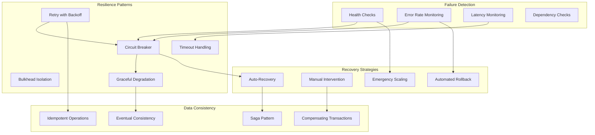

# Resilience & Failure Modes

## 1. System Resilience Patterns



## 2. Circuit Breaker Implementation

### External Service Circuit Breaker

```typescript
// Circuit breaker for external services (FCM, APNs)
enum CircuitState {
  CLOSED = 'closed',     // Normal operation
  OPEN = 'open',         // Failing fast
  HALF_OPEN = 'half_open' // Testing recovery
}

interface CircuitBreakerConfig {
  failureThreshold: number;      // Failures before opening
  recoveryTimeout: number;       // Time before half-open attempt
  monitoringWindow: number;      // Time window for failure tracking
  successThreshold: number;      // Successes needed to close from half-open
  timeout: number;              // Request timeout
}

class CircuitBreaker {
  private state: CircuitState = CircuitState.CLOSED;
  private failureCount: number = 0;
  private successCount: number = 0;
  private lastFailureTime: number = 0;
  private readonly failures: number[] = [];
  
  constructor(
    private readonly config: CircuitBreakerConfig,
    private readonly serviceName: string
  ) {}
  
  async execute<T>(operation: () => Promise<T>): Promise<T> {
    if (this.state === CircuitState.OPEN) {
      if (this.shouldAttemptReset()) {
        this.state = CircuitState.HALF_OPEN;
        this.successCount = 0;
        logger.info(`Circuit breaker transitioning to half-open`, {
          service: this.serviceName,
          event: 'circuit_breaker_half_open'
        });
      } else {
        throw new CircuitBreakerOpenError(
          `Circuit breaker is open for ${this.serviceName}`
        );
      }
    }
    
    try {
      const result = await Promise.race([
        operation(),
        this.timeoutPromise()
      ]);
      
      this.onSuccess();
      return result;
    } catch (error) {
      this.onFailure();
      throw error;
    }
  }
  
  private onSuccess(): void {
    this.failureCount = 0;
    
    if (this.state === CircuitState.HALF_OPEN) {
      this.successCount++;
      
      if (this.successCount >= this.config.successThreshold) {
        this.state = CircuitState.CLOSED;
        logger.info(`Circuit breaker closed`, {
          service: this.serviceName,
          event: 'circuit_breaker_closed'
        });
      }
    }
  }
  
  private onFailure(): void {
    this.failureCount++;
    this.lastFailureTime = Date.now();
    this.failures.push(this.lastFailureTime);
    
    // Clean old failures outside monitoring window
    const cutoff = Date.now() - this.config.monitoringWindow;
    while (this.failures.length > 0 && this.failures[0] < cutoff) {
      this.failures.shift();
    }
    
    if (this.state === CircuitState.HALF_OPEN) {
      this.state = CircuitState.OPEN;
      logger.warn(`Circuit breaker opened from half-open`, {
        service: this.serviceName,
        failureCount: this.failureCount,
        event: 'circuit_breaker_opened'
      });
    } else if (
      this.state === CircuitState.CLOSED && 
      this.failures.length >= this.config.failureThreshold
    ) {
      this.state = CircuitState.OPEN;
      logger.warn(`Circuit breaker opened`, {
        service: this.serviceName,
        failureCount: this.failureCount,
        recentFailures: this.failures.length,
        event: 'circuit_breaker_opened'
      });
    }
  }
  
  private shouldAttemptReset(): boolean {
    return Date.now() - this.lastFailureTime >= this.config.recoveryTimeout;
  }
  
  private timeoutPromise(): Promise<never> {
    return new Promise((_, reject) => {
      setTimeout(() => {
        reject(new TimeoutError(`Operation timed out after ${this.config.timeout}ms`));
      }, this.config.timeout);
    });
  }
  
  getState(): { state: CircuitState; failureCount: number; successCount: number } {
    return {
      state: this.state,
      failureCount: this.failureCount,
      successCount: this.successCount
    };
  }
}

// Circuit breaker configurations for different services
const circuitBreakers = {
  fcm: new CircuitBreaker({
    failureThreshold: 5,
    recoveryTimeout: 60000, // 1 minute
    monitoringWindow: 300000, // 5 minutes
    successThreshold: 3,
    timeout: 10000 // 10 seconds
  }, 'FCM'),
  
  apns: new CircuitBreaker({
    failureThreshold: 3,
    recoveryTimeout: 30000, // 30 seconds
    monitoringWindow: 180000, // 3 minutes
    successThreshold: 2,
    timeout: 15000 // 15 seconds
  }, 'APNs'),
  
  mongodb: new CircuitBreaker({
    failureThreshold: 8,
    recoveryTimeout: 20000, // 20 seconds
    monitoringWindow: 120000, // 2 minutes
    successThreshold: 5,
    timeout: 5000 // 5 seconds
  }, 'MongoDB'),
  
  redis: new CircuitBreaker({
    failureThreshold: 10,
    recoveryTimeout: 10000, // 10 seconds
    monitoringWindow: 60000, // 1 minute
    successThreshold: 3,
    timeout: 2000 // 2 seconds
  }, 'Redis')
};
```

### Retry Strategy with Exponential Backoff

```typescript
// Advanced retry mechanism with jitter
interface RetryConfig {
  maxAttempts: number;
  initialDelay: number;
  maxDelay: number;
  backoffMultiplier: number;
  jitterFactor: number;
  retryableErrors: string[];
}

class RetryService {
  private readonly defaultConfig: RetryConfig = {
    maxAttempts: 3,
    initialDelay: 1000,
    maxDelay: 30000,
    backoffMultiplier: 2,
    jitterFactor: 0.1,
    retryableErrors: [
      'ETIMEDOUT',
      'ECONNRESET',
      'ENOTFOUND',
      'ECONNREFUSED',
      'TIMEOUT'
    ]
  };
  
  async executeWithRetry<T>(
    operation: () => Promise<T>,
    config: Partial<RetryConfig> = {},
    operationName: string = 'unknown'
  ): Promise<T> {
    const finalConfig = { ...this.defaultConfig, ...config };
    let lastError: Error;
    
    for (let attempt = 1; attempt <= finalConfig.maxAttempts; attempt++) {
      try {
        const result = await operation();
        
        if (attempt > 1) {
          logger.info(`Operation succeeded after retry`, {
            operation: operationName,
            attempt,
            event: 'retry_success'
          });
        }
        
        return result;
      } catch (error) {
        lastError = error as Error;
        
        // Don't retry on non-retryable errors
        if (!this.isRetryableError(error as Error, finalConfig)) {
          logger.warn(`Non-retryable error, failing fast`, {
            operation: operationName,
            error: error.message,
            attempt,
            event: 'retry_non_retryable'
          });
          throw error;
        }
        
        // Don't retry on last attempt
        if (attempt === finalConfig.maxAttempts) {
          logger.error(`All retry attempts exhausted`, {
            operation: operationName,
            maxAttempts: finalConfig.maxAttempts,
            error: error.message,
            event: 'retry_exhausted'
          });
          throw error;
        }
        
        const delay = this.calculateDelay(attempt, finalConfig);
        
        logger.warn(`Operation failed, retrying`, {
          operation: operationName,
          attempt,
          nextRetryIn: delay,
          error: error.message,
          event: 'retry_attempt'
        });
        
        await this.sleep(delay);
      }
    }
    
    throw lastError!;
  }
  
  private isRetryableError(error: Error, config: RetryConfig): boolean {
    // Check error codes/types that should be retried
    const errorCode = (error as any).code || (error as any).type || error.name;
    const isRetryable = config.retryableErrors.some(retryableCode => 
      errorCode.includes(retryableCode)
    );
    
    // Check HTTP status codes for retryable errors
    const statusCode = (error as any).status || (error as any).statusCode;
    const isRetryableStatus = statusCode >= 500 || statusCode === 429;
    
    return isRetryable || isRetryableStatus;
  }
  
  private calculateDelay(attempt: number, config: RetryConfig): number {
    // Exponential backoff with jitter
    let delay = config.initialDelay * Math.pow(config.backoffMultiplier, attempt - 1);
    delay = Math.min(delay, config.maxDelay);
    
    // Add jitter to prevent thundering herd
    const jitter = delay * config.jitterFactor * Math.random();
    delay += Math.random() > 0.5 ? jitter : -jitter;
    
    return Math.max(delay, 100); // Minimum delay of 100ms
  }
  
  private sleep(ms: number): Promise<void> {
    return new Promise(resolve => setTimeout(resolve, ms));
  }
}
```

## 3. Failure Mode Analysis

### Common Failure Scenarios

```typescript
// Comprehensive failure mode handling
class FailureModeHandler {
  async handleDatabaseFailure(): Promise<void> {
    logger.error('Database failure detected', {
      event: 'database_failure',
      timestamp: new Date().toISOString()
    });
    
    // 1. Switch to read-only mode
    await this.enableReadOnlyMode();
    
    // 2. Start using cache for critical data
    await this.enableCacheOnlyMode();
    
    // 3. Queue write operations for later replay
    await this.enableWriteQueueMode();
    
    // 4. Alert operations team
    await this.sendDatabaseFailureAlert();
    
    // 5. Attempt automatic recovery
    setTimeout(() => this.attemptDatabaseRecovery(), 30000);
  }
  
  async handleMessageQueueFailure(): Promise<void> {
    logger.error('Message queue failure detected', {
      event: 'messagequeue_failure',
      timestamp: new Date().toISOString()
    });
    
    // 1. Switch to direct database polling
    await this.enableDatabasePollingMode();
    
    // 2. Increase polling frequency
    await this.increasePollingFrequency();
    
    // 3. Store events in dead letter queue
    await this.enableDeadLetterQueue();
    
    // 4. Alert and attempt recovery
    await this.sendMessageQueueFailureAlert();
    setTimeout(() => this.attemptMessageQueueRecovery(), 60000);
  }
  
  async handleExternalServiceFailure(service: 'FCM' | 'APNs'): Promise<void> {
    logger.error(`${service} service failure detected`, {
      event: 'external_service_failure',
      service,
      timestamp: new Date().toISOString()
    });
    
    switch (service) {
      case 'FCM':
        // Fallback to APNs for cross-platform notifications if possible
        await this.enableFCMFallbackMode();
        break;
      case 'APNs':
        // Queue iOS notifications for later retry
        await this.queueIOSNotifications();
        break;
    }
    
    // Store notifications for manual retry
    await this.storeFailedNotifications(service);
  }
  
  async handleHighLatency(): Promise<void> {
    logger.warn('High latency detected', {
      event: 'high_latency_detected',
      timestamp: new Date().toISOString()
    });
    
    // 1. Enable aggressive caching
    await this.enableAggressiveCaching();
    
    // 2. Reduce batch sizes
    await this.reduceBatchSizes();
    
    // 3. Scale up workers
    await this.scaleUpWorkers();
    
    // 4. Enable circuit breakers
    await this.tightenCircuitBreakers();
  }
  
  async handleMemoryPressure(): Promise<void> {
    logger.warn('Memory pressure detected', {
      event: 'memory_pressure',
      timestamp: new Date().toISOString()
    });
    
    // 1. Force garbage collection
    if (global.gc) {
      global.gc();
    }
    
    // 2. Clear non-essential caches
    await this.clearCaches();
    
    // 3. Reduce worker concurrency
    await this.reduceWorkerConcurrency();
    
    // 4. Scale horizontally if possible
    await this.triggerHorizontalScaling();
  }
}
```

### Disaster Recovery Procedures

```yaml
# Disaster Recovery Plan
apiVersion: v1
kind: ConfigMap
metadata:
  name: disaster-recovery-plan
  namespace: notifications
data:
  recovery-procedures.md: |
    # Disaster Recovery Procedures
    
    ## Complete Service Outage
    
    ### Detection
    - All health checks failing
    - No traffic reaching the service
    - Database/Redis/RabbitMQ all unavailable
    
    ### Immediate Actions (0-15 minutes)
    1. Declare incident in PagerDuty
    2. Activate incident command structure
    3. Check cloud provider status pages
    4. Verify network connectivity and DNS
    5. Check Kubernetes cluster health
    
    ### Short-term Recovery (15-60 minutes)
    1. Deploy service to backup region if infrastructure issue
    2. Restore from latest database backup if data corruption
    3. Activate read replicas if primary database failed
    4. Scale up infrastructure if capacity issue
    
    ### Data Recovery
    1. MongoDB: Restore from point-in-time backup
    2. Redis: Rebuild from persistent storage
    3. RabbitMQ: Restore message queues from disk
    
    ## Partial Service Degradation
    
    ### Symptoms
    - Increased error rates (> 5%)
    - High latency (> 2s P95)
    - Some features unavailable
    
    ### Response
    1. Enable degraded mode (non-critical features disabled)
    2. Scale up affected components
    3. Implement fallback mechanisms
    4. Queue non-urgent operations
    
    ## Data Breach Response
    
    ### Immediate Actions (0-1 hour)
    1. Isolate affected systems
    2. Preserve forensic evidence
    3. Notify security team and legal
    4. Document timeline and scope
    
    ### Short-term Actions (1-24 hours)
    1. Assess impact and affected data
    2. Notify affected users if required
    3. Implement additional security controls
    4. Work with external security experts
    
    ### Long-term Actions (1-30 days)
    1. Conduct thorough security audit
    2. Implement lessons learned
    3. Update security procedures
    4. Provide user notifications and support
  
  backup-strategy.md: |
    # Backup Strategy
    
    ## MongoDB Backups
    - Full backup: Daily at 2 AM UTC
    - Incremental backup: Every 4 hours
    - Point-in-time recovery: 1-second granularity
    - Retention: 30 days full, 7 days incremental
    - Cross-region replication: Enabled
    
    ## Redis Backups
    - RDB snapshots: Every 6 hours
    - AOF persistence: Always enabled
    - Retention: 7 days
    - Memory dump on shutdown: Enabled
    
    ## Configuration Backups
    - Kubernetes manifests: Git repository
    - Secrets: External secrets manager
    - Environment configs: Version controlled
    - Infrastructure as Code: Terraform state backup
    
    ## Recovery Testing
    - Monthly disaster recovery drills
    - Quarterly full environment rebuild
    - Annual business continuity exercise
    - Automated backup verification
```

## 4. Graceful Degradation Strategies

```typescript
// Feature flags for graceful degradation
class FeatureFlagService {
  private readonly flags = new Map<string, boolean>();
  private readonly redis: RedisClient;
  
  constructor(redis: RedisClient) {
    this.redis = redis;
    this.loadFlags();
    
    // Refresh flags every 30 seconds
    setInterval(() => this.loadFlags(), 30000);
  }
  
  async isEnabled(flagName: string): Promise<boolean> {
    // Check local cache first
    if (this.flags.has(flagName)) {
      return this.flags.get(flagName)!;
    }
    
    // Fallback to Redis
    try {
      const value = await this.redis.get(`feature_flag:${flagName}`);
      const enabled = value === 'true';
      this.flags.set(flagName, enabled);
      return enabled;
    } catch (error) {
      // Default to disabled if Redis is unavailable
      logger.warn(`Failed to check feature flag ${flagName}`, error);
      return false;
    }
  }
  
  async setFlag(flagName: string, enabled: boolean): Promise<void> {
    this.flags.set(flagName, enabled);
    await this.redis.set(`feature_flag:${flagName}`, enabled.toString());
    
    logger.info(`Feature flag updated`, {
      flag: flagName,
      enabled,
      event: 'feature_flag_updated'
    });
  }
  
  private async loadFlags(): Promise<void> {
    try {
      const keys = await this.redis.keys('feature_flag:*');
      const pipeline = this.redis.pipeline();
      
      keys.forEach(key => pipeline.get(key));
      const results = await pipeline.exec();
      
      keys.forEach((key, index) => {
        const flagName = key.replace('feature_flag:', '');
        const enabled = results?.[index]?.[1] === 'true';
        this.flags.set(flagName, enabled);
      });
    } catch (error) {
      logger.error('Failed to load feature flags', error);
    }
  }
}

// Degraded mode implementation
class DegradedModeService {
  constructor(
    private featureFlags: FeatureFlagService,
    private healthChecker: HealthCheckService
  ) {}
  
  async handleNotificationRequest(req: NotificationRequest): Promise<NotificationResponse> {
    const systemHealth = await this.healthChecker.getOverallHealth();
    
    // Check if we need to operate in degraded mode
    if (systemHealth.status === 'degraded') {
      return await this.handleDegradedMode(req, systemHealth);
    }
    
    return await this.handleNormalMode(req);
  }
  
  private async handleDegradedMode(
    req: NotificationRequest, 
    health: HealthStatus
  ): Promise<NotificationResponse> {
    logger.warn('Operating in degraded mode', {
      health: health.status,
      issues: health.issues,
      event: 'degraded_mode_active'
    });
    
    // 1. Disable non-essential features
    const analyticsEnabled = await this.featureFlags.isEnabled('analytics_tracking');
    if (analyticsEnabled && health.issues.includes('high_latency')) {
      await this.featureFlags.setFlag('analytics_tracking', false);
    }
    
    // 2. Use simplified processing
    if (health.issues.includes('database_slow')) {
      return await this.processWithCache(req);
    }
    
    // 3. Queue non-urgent notifications
    if (req.priority !== 'high' && health.issues.includes('external_service_down')) {
      await this.queueForLater(req);
      return { status: 'queued', message: 'Notification queued due to service issues' };
    }
    
    // 4. Use fallback mechanisms
    if (health.issues.includes('fcm_down') && req.platform === 'android') {
      return await this.tryAlternativeDelivery(req);
    }
    
    return await this.handleNormalMode(req);
  }
  
  private async processWithCache(req: NotificationRequest): Promise<NotificationResponse> {
    // Use cached data instead of database queries
    const cachedUserPrefs = await this.getCachedUserPreferences(req.userId);
    
    if (!cachedUserPrefs) {
      // Fallback to default preferences
      return await this.processWithDefaults(req);
    }
    
    return await this.createNotificationFromCache(req, cachedUserPrefs);
  }
  
  private async tryAlternativeDelivery(req: NotificationRequest): Promise<NotificationResponse> {
    // Try alternative delivery methods
    if (await this.featureFlags.isEnabled('email_fallback')) {
      return await this.sendEmailNotification(req);
    }
    
    if (await this.featureFlags.isEnabled('sms_fallback')) {
      return await this.sendSMSNotification(req);
    }
    
    // Queue for retry when service recovers
    await this.queueForRetry(req);
    return { status: 'queued', message: 'Notification queued for retry' };
  }
}
```

## 5. Auto-Recovery Mechanisms

```typescript
// Automated recovery system
class AutoRecoveryService {
  private readonly recoveryAttempts = new Map<string, number>();
  private readonly maxRecoveryAttempts = 3;
  
  async startRecoveryProcess(failure: FailureEvent): Promise<void> {
    const attemptKey = `${failure.type}_${failure.component}`;
    const attempts = this.recoveryAttempts.get(attemptKey) || 0;
    
    if (attempts >= this.maxRecoveryAttempts) {
      logger.error(`Max recovery attempts reached`, {
        failure: attemptKey,
        attempts,
        event: 'recovery_exhausted'
      });
      await this.escalateToHuman(failure);
      return;
    }
    
    this.recoveryAttempts.set(attemptKey, attempts + 1);
    
    try {
      await this.executeRecoveryPlan(failure);
      
      // Reset counter on successful recovery
      this.recoveryAttempts.delete(attemptKey);
      
      logger.info(`Auto-recovery successful`, {
        failure: attemptKey,
        attempts: attempts + 1,
        event: 'recovery_successful'
      });
    } catch (error) {
      logger.error(`Recovery attempt failed`, {
        failure: attemptKey,
        attempts: attempts + 1,
        error: error.message,
        event: 'recovery_failed'
      });
      
      // Exponential backoff before next attempt
      const delay = Math.min(Math.pow(2, attempts) * 1000, 60000);
      setTimeout(() => this.startRecoveryProcess(failure), delay);
    }
  }
  
  private async executeRecoveryPlan(failure: FailureEvent): Promise<void> {
    switch (failure.type) {
      case 'database_connection':
        await this.recoverDatabaseConnection(failure);
        break;
      case 'memory_leak':
        await this.recoverFromMemoryLeak(failure);
        break;
      case 'queue_backlog':
        await this.recoverFromQueueBacklog(failure);
        break;
      case 'external_service':
        await this.recoverExternalService(failure);
        break;
      default:
        throw new Error(`Unknown failure type: ${failure.type}`);
    }
  }
  
  private async recoverDatabaseConnection(failure: FailureEvent): Promise<void> {
    // 1. Close existing connections
    await this.closeStaleConnections();
    
    // 2. Wait for connection pool to drain
    await this.sleep(5000);
    
    // 3. Reinitialize connection pool
    await this.reinitializeDatabase();
    
    // 4. Test connection
    await this.testDatabaseConnection();
  }
  
  private async recoverFromMemoryLeak(failure: FailureEvent): Promise<void> {
    // 1. Force garbage collection
    if (global.gc) {
      global.gc();
    }
    
    // 2. Clear caches
    await this.clearAllCaches();
    
    // 3. Restart worker processes
    await this.restartWorkerProcesses();
    
    // 4. Monitor memory usage
    await this.enableMemoryMonitoring();
  }
  
  private async recoverFromQueueBacklog(failure: FailureEvent): Promise<void> {
    // 1. Scale up workers temporarily
    await this.temporaryScaleUp(failure.component, 2);
    
    // 2. Increase batch sizes
    await this.increaseBatchSizes();
    
    // 3. Enable parallel processing
    await this.enableParallelProcessing();
    
    // 4. Set up backlog monitoring
    await this.monitorQueueBacklog();
  }
  
  private async escalateToHuman(failure: FailureEvent): Promise<void> {
    const alert = {
      severity: 'critical',
      title: `Auto-recovery failed: ${failure.type}`,
      description: `Failed to automatically recover from ${failure.type} after ${this.maxRecoveryAttempts} attempts`,
      component: failure.component,
      timestamp: new Date().toISOString(),
      runbook: this.getRunbookURL(failure.type)
    };
    
    await this.sendPagerDutyAlert(alert);
    await this.createJiraTicket(alert);
    await this.notifySlackChannel(alert);
  }
}
```