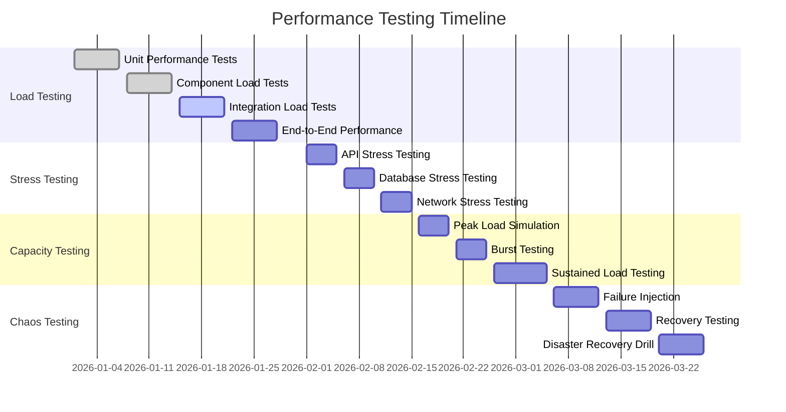

# Performance Targets

## 1. Service Level Agreements (SLAs)

### Availability Targets

| Service Component | Target SLA | Monthly Downtime | Measurement |
|------------------|------------|------------------|-------------|
| **Notification API** | 99.5% | 3.6 hours | HTTP 200 responses / total requests |
| **Push Delivery** | 99.0% | 7.2 hours | Successful deliveries / total attempts |
| **Event Processing** | 99.9% | 0.7 hours | Events processed / events received |
| **Overall System** | 99.5% | 3.6 hours | End-to-end successful transactions |

### Performance SLAs

```typescript
// Performance target definitions
interface PerformanceSLA {
  metric: string;
  target: string;
  measurement: string;
  consequences: string[];
}

const performanceSLAs: PerformanceSLA[] = [
  {
    metric: 'API Response Time',
    target: 'P95 < 200ms, P99 < 500ms',
    measurement: 'HTTP request duration from receipt to response',
    consequences: [
      'P95 > 300ms: Alert development team',
      'P95 > 500ms: Page on-call engineer',
      'P95 > 1000ms: Activate incident response'
    ]
  },
  {
    metric: 'End-to-End Delivery Latency',
    target: 'P95 < 10 seconds, P99 < 30 seconds',
    measurement: 'Time from event creation to device receipt confirmation',
    consequences: [
      'P95 > 15s: Investigate delivery pipeline',
      'P95 > 30s: Scale delivery workers',
      'P95 > 60s: Enable emergency protocols'
    ]
  },
  {
    metric: 'Peak Throughput Capacity',
    target: '100,000 notifications/second',
    measurement: 'Sustained rate over 5-minute window',
    consequences: [
      'Capacity < 80k/s: Plan infrastructure scaling',
      'Capacity < 60k/s: Immediate scaling required',
      'Capacity < 40k/s: Emergency capacity addition'
    ]
  },
  {
    metric: 'Event Processing Lag',
    target: 'P95 < 2 seconds',
    measurement: 'Time from event arrival to processing completion',
    consequences: [
      'Lag > 5s: Scale event consumers',
      'Lag > 10s: Enable fast-track processing',
      'Lag > 30s: Activate backlog clearing protocol'
    ]
  },
  {
    metric: 'Database Query Performance',
    target: 'P95 < 50ms',
    measurement: 'Database operation duration including connection time',
    consequences: [
      'P95 > 100ms: Review query optimization',
      'P95 > 200ms: Check database health',
      'P95 > 500ms: Activate database incident response'
    ]
  }
];
```

## 2. Load Testing & Benchmarks

### Performance Testing Strategy



### Load Testing Configuration

```yaml
# k6 load testing script configuration
apiVersion: v1
kind: ConfigMap
metadata:
  name: load-test-config
  namespace: notifications
data:
  api-load-test.js: |
    import http from 'k6/http';
    import { check, sleep } from 'k6';
    import { Rate, Trend, Counter } from 'k6/metrics';
    
    // Custom metrics
    const errorRate = new Rate('error_rate');
    const responseTime = new Trend('response_time');
    const notificationsSent = new Counter('notifications_sent');
    
    // Test scenarios
    export let options = {
      scenarios: {
        // Baseline load test
        baseline_load: {
          executor: 'constant-vus',
          vus: 100,
          duration: '10m',
          tags: { test_type: 'baseline' }
        },
        
        // Stress test - find breaking point
        stress_test: {
          executor: 'ramping-vus',
          startVUs: 0,
          stages: [
            { duration: '5m', target: 200 },
            { duration: '10m', target: 500 },
            { duration: '10m', target: 1000 },
            { duration: '10m', target: 2000 },
            { duration: '5m', target: 0 }
          ],
          tags: { test_type: 'stress' }
        },
        
        // Peak load simulation
        peak_load: {
          executor: 'constant-arrival-rate',
          rate: 1000, // 1000 RPS
          timeUnit: '1s',
          duration: '30m',
          preAllocatedVUs: 500,
          maxVUs: 1000,
          tags: { test_type: 'peak' }
        },
        
        // Burst testing
        burst_test: {
          executor: 'ramping-arrival-rate',
          startRate: 100,
          stages: [
            { duration: '1m', target: 100 },
            { duration: '30s', target: 2000 }, // Sudden burst
            { duration: '2m', target: 2000 },
            { duration: '30s', target: 100 },
            { duration: '1m', target: 100 }
          ],
          preAllocatedVUs: 100,
          maxVUs: 2000,
          tags: { test_type: 'burst' }
        }
      },
      
      // Performance thresholds
      thresholds: {
        'http_req_duration': ['p(95)<200', 'p(99)<500'],
        'http_req_duration{test_type:baseline}': ['p(95)<150'],
        'http_req_duration{test_type:stress}': ['p(95)<300'],
        'http_req_duration{test_type:peak}': ['p(95)<200'],
        'error_rate': ['rate<0.05'], // Less than 5% error rate
        'http_req_failed': ['rate<0.01'] // Less than 1% failed requests
      }
    };
    
    // Test data generators
    const users = Array.from({length: 1000}, (_, i) => `user_${i}`);
    const notificationTypes = ['follow', 'comment', 'mention', 'like'];
    
    export default function() {
      const userId = users[Math.floor(Math.random() * users.length)];
      const notificationType = notificationTypes[Math.floor(Math.random() * notificationTypes.length)];
      
      const payload = {
        userId: userId,
        title: `New ${notificationType} notification`,
        body: `You have a new ${notificationType}`,
        data: {
          type: notificationType,
          timestamp: Date.now()
        },
        priority: Math.random() > 0.8 ? 'high' : 'normal'
      };
      
      const params = {
        headers: {
          'Content-Type': 'application/json',
          'Authorization': 'Bearer test-token'
        },
        tags: {
          endpoint: 'create-notification',
          priority: payload.priority
        }
      };
      
      const response = http.post(
        'http://notification-api.notifications.svc.cluster.local/api/notifications',
        JSON.stringify(payload),
        params
      );
      
      // Record metrics
      responseTime.add(response.timings.duration);
      errorRate.add(response.status !== 201);
      if (response.status === 201) {
        notificationsSent.add(1);
      }
      
      // Validate response
      check(response, {
        'status is 201': (r) => r.status === 201,
        'response time < 200ms': (r) => r.timings.duration < 200,
        'response has notification id': (r) => {
          const body = JSON.parse(r.body);
          return body && body.notificationId;
        }
      });
      
      sleep(Math.random() * 2); // Random think time
    }
  
  worker-load-test.js: |
    // Load test for delivery workers
    import { check } from 'k6';
    import ws from 'k6/ws';
    
    export let options = {
      scenarios: {
        delivery_load: {
          executor: 'constant-vus',
          vus: 50,
          duration: '15m'
        }
      }
    };
    
    export default function() {
      // Simulate high-volume delivery scenarios
      const url = 'ws://notification-worker.notifications.svc.cluster.local/metrics';
      const params = { tags: { test_type: 'delivery' } };
      
      const response = ws.connect(url, params, function(socket) {
        socket.on('open', function() {
          socket.send(JSON.stringify({
            action: 'simulate_delivery_batch',
            batchSize: 100,
            platform: Math.random() > 0.5 ? 'ios' : 'android'
          }));
        });
        
        socket.on('message', function(message) {
          const data = JSON.parse(message);
          check(data, {
            'batch processed successfully': (d) => d.status === 'success',
            'delivery time acceptable': (d) => d.processingTime < 5000
          });
        });
        
        socket.setTimeout(function() {
          socket.close();
        }, 10000);
      });
    }
```

### Benchmark Results

```typescript
// Historical benchmark data tracking
interface BenchmarkResult {
  timestamp: Date;
  testType: 'baseline' | 'stress' | 'peak' | 'burst';
  duration: number;
  metrics: {
    rps: number;
    p95ResponseTime: number;
    p99ResponseTime: number;
    errorRate: number;
    cpuUtilization: number;
    memoryUtilization: number;
    throughput: number;
  };
  configuration: {
    replicas: number;
    resources: {
      cpu: string;
      memory: string;
    };
  };
}

// Target benchmarks for different scenarios
const performanceBenchmarks = {
  baseline: {
    expectedRPS: 1000,
    expectedP95: 150, // ms
    expectedErrorRate: 0.01, // 1%
    expectedCPU: 0.6, // 60%
    expectedMemory: 0.7 // 70%
  },
  
  stress: {
    breakingPointRPS: 5000,
    degradationP95: 500, // ms
    maxErrorRate: 0.05, // 5%
    maxCPU: 0.9, // 90%
    maxMemory: 0.85 // 85%
  },
  
  peak: {
    sustainedRPS: 2000,
    peakP95: 200, // ms
    targetErrorRate: 0.02, // 2%
    targetCPU: 0.8, // 80%
    targetMemory: 0.75 // 75%
  },
  
  burst: {
    burstRPS: 10000,
    burstDuration: 60, // seconds
    recoveryTime: 30, // seconds
    maxP95DuringBurst: 300, // ms
    postBurstP95: 200 // ms
  }
};
```

## 3. Resource Capacity Planning

### Infrastructure Sizing Model

```typescript
// Capacity planning calculator
class CapacityPlanner {
  private readonly baselineMetrics = {
    rpsPerCPUCore: 200,      // Requests per second per CPU core
    memoryPerRequest: 2,     // MB memory per concurrent request
    dbConnectionsPerCore: 10, // DB connections per CPU core
    notificationsPerWorker: 50 // Notifications per worker per second
  };
  
  calculateRequiredResources(targetLoad: LoadRequirements): ResourcePlan {
    const targetRPS = targetLoad.peakRPS * 1.2; // 20% buffer
    const concurrentUsers = targetLoad.concurrentUsers * 1.15; // 15% buffer
    
    return {
      api: this.calculateAPIResources(targetRPS, concurrentUsers),
      workers: this.calculateWorkerResources(targetLoad.notificationsPerSecond),
      database: this.calculateDatabaseResources(targetLoad),
      cache: this.calculateCacheResources(targetLoad)
    };
  }
  
  private calculateAPIResources(targetRPS: number, concurrentUsers: number): ServiceResources {
    const requiredCores = Math.ceil(targetRPS / this.baselineMetrics.rpsPerCPUCore);
    const requiredMemory = Math.ceil(
      (concurrentUsers * this.baselineMetrics.memoryPerRequest) / 1024 // Convert to GB
    );
    const requiredReplicas = Math.max(3, Math.ceil(requiredCores / 4)); // Max 4 cores per pod
    
    return {
      replicas: requiredReplicas,
      cpu: `${Math.min(4, Math.ceil(requiredCores / requiredReplicas))}`,
      memory: `${Math.ceil(requiredMemory / requiredReplicas)}Gi`,
      maxReplicas: requiredReplicas * 2, // For auto-scaling
      estimatedCost: this.calculateMonthlyCost('api', requiredReplicas, requiredCores, requiredMemory)
    };
  }
  
  private calculateWorkerResources(notificationsPerSecond: number): ServiceResources {
    const requiredWorkers = Math.ceil(notificationsPerSecond / this.baselineMetrics.notificationsPerWorker);
    const workersPerReplica = 2; // 2 worker threads per pod
    const requiredReplicas = Math.ceil(requiredWorkers / workersPerReplica);
    
    return {
      replicas: requiredReplicas,
      cpu: "1", // 1 CPU core per worker pod
      memory: "2Gi", // 2GB memory per worker pod
      maxReplicas: requiredReplicas * 3,
      estimatedCost: this.calculateMonthlyCost('worker', requiredReplicas, requiredReplicas, requiredReplicas * 2)
    };
  }
  
  private calculateDatabaseResources(load: LoadRequirements): DatabaseResources {
    const connectionsNeeded = load.peakRPS * 0.1; // 10% of requests need DB
    const storageGrowthGB = load.dailyNotifications * 0.001; // 1KB per notification
    const monthlyStorageGB = storageGrowthGB * 30;
    
    return {
      connections: Math.ceil(connectionsNeeded * 1.5), // 50% buffer
      cpu: Math.ceil(connectionsNeeded / 100), // 100 connections per CPU
      memory: Math.ceil(monthlyStorageGB * 0.25), // 25% of data size in memory
      storage: Math.ceil(monthlyStorageGB * 12 * 1.5), // 1 year data + 50% buffer
      replicas: 3, // 1 primary + 2 secondaries
      estimatedCost: this.calculateDatabaseCost(monthlyStorageGB, connectionsNeeded)
    };
  }
  
  generateCapacityReport(currentLoad: LoadRequirements): CapacityReport {
    const currentResources = this.getCurrentResourceUsage();
    const requiredResources = this.calculateRequiredResources(currentLoad);
    
    return {
      currentUsage: currentResources,
      requiredCapacity: requiredResources,
      scalingRecommendations: this.generateScalingRecommendations(currentResources, requiredResources),
      costImpact: this.calculateCostImpact(currentResources, requiredResources),
      timeline: this.generateScalingTimeline(currentResources, requiredResources)
    };
  }
}

// Example capacity planning scenarios
const capacityScenarios = {
  currentProduction: {
    peakRPS: 1000,
    concurrentUsers: 5000,
    notificationsPerSecond: 500,
    dailyNotifications: 1000000
  },
  
  sixMonthProjection: {
    peakRPS: 2500,
    concurrentUsers: 12000,
    notificationsPerSecond: 1200,
    dailyNotifications: 2500000
  },
  
  yearProjection: {
    peakRPS: 5000,
    concurrentUsers: 25000,
    notificationsPerSecond: 2500,
    dailyNotifications: 5000000
  },
  
  blackFridayScenario: {
    peakRPS: 15000,
    concurrentUsers: 75000,
    notificationsPerSecond: 10000,
    dailyNotifications: 20000000
  }
};
```

## 4. Performance Optimization Strategies

### Database Optimization

```typescript
// Database performance optimization
class DatabaseOptimizer {
  async optimizeQueries(): Promise<void> {
    // 1. Index optimization
    await this.createOptimalIndexes();
    
    // 2. Query optimization
    await this.optimizeSlowQueries();
    
    // 3. Connection pool tuning
    await this.optimizeConnectionPool();
  }
  
  private async createOptimalIndexes(): Promise<void> {
    const indexes = [
      // Compound index for notification queries
      {
        collection: 'notifications',
        index: { userId: 1, createdAt: -1, status: 1 },
        options: { background: true }
      },
      
      // Index for device token lookups
      {
        collection: 'devices',
        index: { userId: 1, platform: 1, isActive: 1 },
        options: { background: true }
      },
      
      // TTL index for automatic cleanup
      {
        collection: 'notifications',
        index: { createdAt: 1 },
        options: { 
          expireAfterSeconds: 30 * 24 * 60 * 60, // 30 days
          background: true 
        }
      },
      
      // Sparse index for scheduled notifications
      {
        collection: 'notifications',
        index: { scheduledFor: 1 },
        options: { sparse: true, background: true }
      }
    ];
    
    for (const indexDef of indexes) {
      await db.collection(indexDef.collection)
        .createIndex(indexDef.index, indexDef.options);
      
      logger.info(`Created index on ${indexDef.collection}`, {
        index: indexDef.index,
        event: 'index_created'
      });
    }
  }
  
  private async optimizeConnectionPool(): Promise<void> {
    const poolConfig = {
      minPoolSize: 5,
      maxPoolSize: 50,
      maxIdleTimeMS: 30000,
      waitQueueTimeoutMS: 5000,
      serverSelectionTimeoutMS: 5000
    };
    
    await this.updateConnectionPoolSettings(poolConfig);
  }
}
```

### Caching Strategy

```typescript
// Multi-tier caching implementation
class CacheOptimizer {
  private readonly l1Cache = new Map(); // In-memory cache
  private readonly l2Cache: RedisClient; // Redis cache
  private readonly l3Cache: CDNClient;   // CDN cache
  
  async optimizeCaching(): Promise<void> {
    // Configure cache layers with appropriate TTLs
    await this.setupCacheLayers();
    
    // Implement cache warming strategies
    await this.warmCriticalCaches();
    
    // Set up cache invalidation
    await this.setupCacheInvalidation();
  }
  
  private async setupCacheLayers(): Promise<void> {
    const cacheConfig = {
      userPreferences: {
        l1TTL: 300,    // 5 minutes in memory
        l2TTL: 3600,   // 1 hour in Redis
        l3TTL: 86400   // 1 day in CDN
      },
      
      deviceTokens: {
        l1TTL: 600,    // 10 minutes in memory
        l2TTL: 7200,   // 2 hours in Redis
        l3TTL: 0       // No CDN caching for security
      },
      
      templateData: {
        l1TTL: 1800,   // 30 minutes in memory
        l2TTL: 21600,  // 6 hours in Redis
        l3TTL: 604800  // 1 week in CDN
      }
    };
    
    await this.configureCacheTTLs(cacheConfig);
  }
  
  private async warmCriticalCaches(): Promise<void> {
    // Pre-load frequently accessed data
    const criticalData = [
      this.warmUserPreferences(),
      this.warmActiveDeviceTokens(),
      this.warmNotificationTemplates()
    ];
    
    await Promise.all(criticalData);
  }
}
```

## 5. Real-time Performance Monitoring

```yaml
# Performance monitoring dashboard
apiVersion: v1
kind: ConfigMap
metadata:
  name: performance-dashboard
  namespace: notifications
data:
  grafana-dashboard.json: |
    {
      "dashboard": {
        "title": "Notification Service - Performance Monitoring",
        "panels": [
          {
            "title": "SLA Compliance",
            "type": "stat",
            "targets": [
              {
                "expr": "(
                  sum(rate(http_requests_total{job=\"notification-api\", code!~\"5..\"}[5m])) /
                  sum(rate(http_requests_total{job=\"notification-api\"}[5m]))
                ) * 100",
                "legendFormat": "API Availability %",
                "refId": "A"
              },
              {
                "expr": "histogram_quantile(0.95, 
                  sum(rate(http_request_duration_seconds_bucket[5m])) by (le)
                ) * 1000",
                "legendFormat": "P95 Response Time (ms)",
                "refId": "B"
              }
            ],
            "fieldConfig": {
              "defaults": {
                "thresholds": {
                  "steps": [
                    { "color": "red", "value": 0 },
                    { "color": "yellow", "value": 95 },
                    { "color": "green", "value": 99.5 }
                  ]
                }
              }
            }
          },
          {
            "title": "Throughput vs Capacity",
            "type": "graph",
            "targets": [
              {
                "expr": "sum(rate(http_requests_total[1m]))",
                "legendFormat": "Current RPS"
              },
              {
                "expr": "scalar(100000)",
                "legendFormat": "Target Capacity (100K/s)"
              }
            ]
          },
          {
            "title": "Performance Targets Status",
            "type": "table",
            "targets": [
              {
                "expr": "up{job=\"notification-api\"} * 100",
                "legendFormat": "Service Health %",
                "refId": "health"
              },
              {
                "expr": "histogram_quantile(0.95, 
                  sum(rate(http_request_duration_seconds_bucket[5m])) by (le)
                ) * 1000",
                "legendFormat": "P95 Latency (ms)",
                "refId": "latency"
              },
              {
                "expr": "sum(rate(notifications_delivered_total{status=\"success\"}[5m])) /
                  sum(rate(notifications_delivered_total[5m])) * 100",
                "legendFormat": "Delivery Success %",
                "refId": "delivery"
              }
            ],
            "transformations": [
              {
                "id": "organize",
                "options": {
                  "excludeByName": {},
                  "indexByName": {},
                  "renameByName": {
                    "Value #health": "Health %",
                    "Value #latency": "Latency (ms)",
                    "Value #delivery": "Delivery %"
                  }
                }
              }
            ]
          }
        ]
      }
    }
```