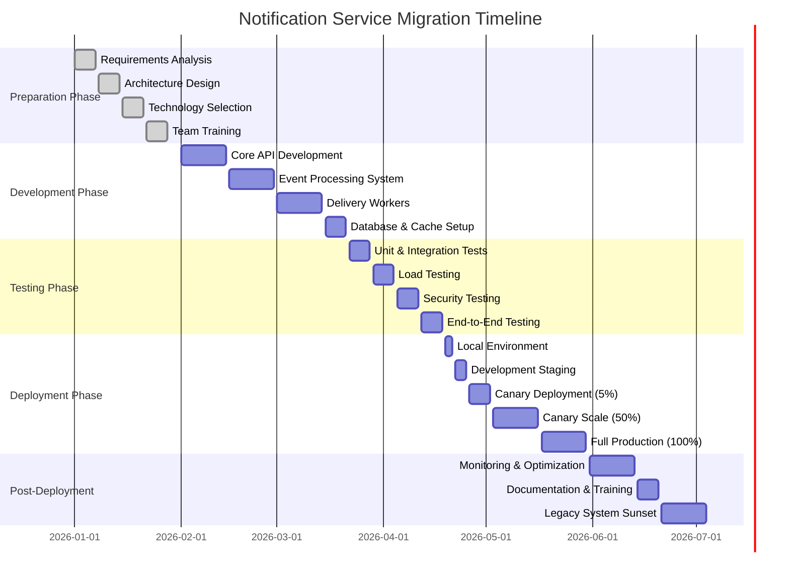
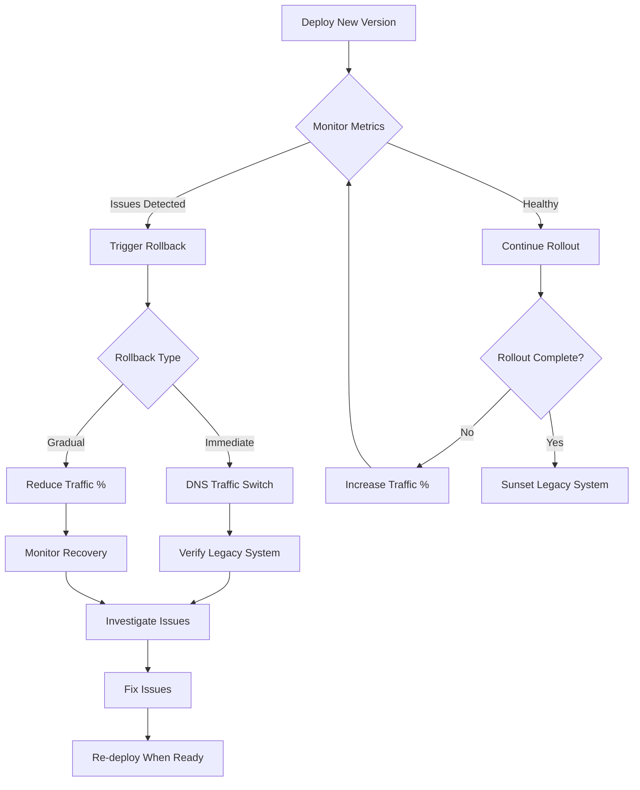
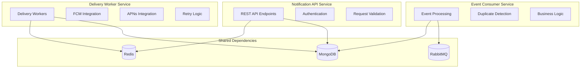

# Migration Plan & Key Design Decisions

## 1. Week-by-Week Rollout Strategy



### Detailed Weekly Breakdown

#### Week 1-4: Preparation Phase

**Week 1: Requirements Gathering**
- [ ] Stakeholder interviews and requirement documentation
- [ ] Current system analysis and pain point identification
- [ ] SLA and performance target definition
- [ ] Compliance and security requirement review

**Week 2: Architecture Design**
- [ ] System architecture design and review
- [ ] Database schema design and optimization
- [ ] API contract definition and versioning strategy
- [ ] Event schema definition (Phase 0 requirements)

**Week 3: Technology Selection**
- [ ] Technology stack evaluation and selection
- [ ] Infrastructure provider selection (AWS/Azure/GCP)
- [ ] Third-party service integration planning (FCM, APNs)
- [ ] Development and deployment toolchain setup

**Week 4: Team Preparation**
- [ ] Team training on selected technologies
- [ ] Development environment setup
- [ ] CI/CD pipeline configuration
- [ ] Code repository and branching strategy setup

#### Week 5-10: Development Phase

**Week 5-6: Core API Development**
```typescript
// Development milestones
const developmentMilestones = {
  week5: [
    'REST API endpoints implementation',
    'Authentication and authorization',
    'Input validation and sanitization',
    'Basic CRUD operations for notifications'
  ],
  
  week6: [
    'Device registration and management',
    'User preferences system',
    'Notification template engine',
    'API documentation and testing'
  ]
};
```

**Week 7-8: Event Processing System**
- [ ] RabbitMQ integration and queue setup
- [ ] Event consumer implementation
- [ ] Idempotency and duplicate handling
- [ ] Dead letter queue configuration

**Week 9-10: Delivery Workers**
- [ ] FCM integration and batch processing
- [ ] APNs integration and certificate management
- [ ] Retry mechanisms and error handling
- [ ] Circuit breaker implementation

**Week 11: Data Layer Setup**
- [ ] MongoDB cluster setup and configuration
- [ ] Redis cluster setup and optimization
- [ ] Database migrations and seed data
- [ ] Backup and recovery procedures

#### Week 12-15: Testing Phase

**Week 12: Unit & Integration Testing**
```yaml
# Testing strategy configuration
testing:
  unit_tests:
    target_coverage: 90%
    frameworks: [jest, supertest]
    reports: [lcov, html, json]
    
  integration_tests:
    database_tests: mongoose-integration
    api_tests: supertest
    queue_tests: amqplib-mocks
    
  quality_gates:
    - coverage >= 90%
    - no critical security vulnerabilities
    - all integration tests pass
    - performance benchmarks meet targets
```

**Week 13: Load Testing**
- [ ] API load testing with k6
- [ ] Database stress testing
- [ ] Queue throughput testing
- [ ] End-to-end performance validation

**Week 14: Security Testing**
- [ ] OWASP security scanning
- [ ] Penetration testing
- [ ] Secrets and certificate validation
- [ ] Access control verification

**Week 15: End-to-End Testing**
- [ ] Full user journey testing
- [ ] Multi-platform notification delivery
- [ ] Disaster recovery testing
- [ ] Monitoring and alerting validation

#### Week 16-21: Deployment Phase

**Week 16: Local Environment (April 19-21)**
```bash
# Local deployment checklist
local_deployment:
  - docker-compose up -d
  - npm run db:migrate
  - npm run test:e2e
  - npm run load:test
  - health check validation
```

**Week 17: Development Staging (April 22-25)**
- [ ] Deploy to staging environment
- [ ] Integration with external services
- [ ] Monitoring dashboard configuration
- [ ] Performance baseline establishment

**Week 18-19: Canary Deployment 5% (April 26 - May 2)**
```typescript
// Canary deployment configuration
const canaryConfig = {
  percentage: 5,
  duration: '1 week',
  criteria: {
    errorRate: '< 1%',
    latency: 'P95 < 200ms',
    availability: '> 99.5%'
  },
  rollbackTriggers: [
    'errorRate > 2%',
    'latency P95 > 500ms',
    'availability < 99%'
  ]
};
```

**Week 20-21: Canary Scale to 50% (May 3-16)**
- [ ] Monitor 5% canary performance
- [ ] Gradual traffic increase to 50%
- [ ] Performance optimization based on real traffic
- [ ] Incident response procedure validation

**Week 22-23: Full Production 100% (May 17-30)**
- [ ] Final traffic migration to new system
- [ ] Legacy system parallel running
- [ ] Data consistency verification
- [ ] Performance monitoring and optimization

### Rollback Strategy



## 2. Key Design Decisions & Rationale

### Decision 1: Event-Driven Architecture vs Direct API Calls

**Decision**: Event-driven architecture with RabbitMQ

**Rationale**:
```typescript
// Comparison analysis
const architectureComparison = {
  eventDriven: {
    pros: [
      'Loose coupling between services',
      'Async processing capability',
      'Built-in retry and dead letter queues',
      'Easy to scale individual components',
      'Natural audit trail of events'
    ],
    cons: [
      'Additional infrastructure complexity',
      'Eventual consistency challenges',
      'Message ordering considerations',
      'Debugging can be more complex'
    ],
    score: 8.5
  },
  
  directAPI: {
    pros: [
      'Simpler architecture',
      'Immediate consistency',
      'Easier debugging',
      'Lower operational overhead'
    ],
    cons: [
      'Tight coupling between services',
      'Cascading failure risk',
      'Harder to handle traffic spikes',
      'No built-in retry mechanisms'
    ],
    score: 6.0
  }
};

// Decision criteria weights
const decisionCriteria = {
  scalability: { weight: 0.25, eventDriven: 9, directAPI: 6 },
  reliability: { weight: 0.30, eventDriven: 8, directAPI: 5 },
  maintainability: { weight: 0.20, eventDriven: 7, directAPI: 8 },
  performance: { weight: 0.15, eventDriven: 8, directAPI: 9 },
  complexity: { weight: 0.10, eventDriven: 5, directAPI: 9 }
};
```

**Alternatives Considered**:
- Direct HTTP API calls between services
- Database polling for event detection
- AWS SQS/SNS for message queuing

**Trade-offs**:
- **Chosen**: Event-driven provides better scalability and fault tolerance
- **Rejected**: Direct API calls would create tight coupling and cascading failures

### Decision 2: MongoDB vs PostgreSQL for Primary Database

**Decision**: MongoDB for document storage

**Rationale**:
```sql
-- Document structure example showing why NoSQL was chosen
{
  "_id": ObjectId("..."),
  "userId": "user123",
  "title": "New follower",
  "body": "John Doe started following you",
  "data": {
    "followerId": "user456",
    "followerName": "John Doe",
    "followerAvatar": "https://...",
    "timestamp": "2026-01-01T10:00:00Z"
  },
  "platforms": ["ios", "android"],
  "delivery": {
    "ios": {
      "status": "delivered",
      "deliveredAt": "2026-01-01T10:00:15Z",
      "apnsResponse": { "success": true }
    },
    "android": {
      "status": "failed",
      "error": "Invalid registration token",
      "retryCount": 2
    }
  }
}
```

**Why MongoDB Won**:
- Flexible schema for notification payloads
- Natural JSON storage for mobile push notifications
- Built-in horizontal sharding capabilities
- Better performance for write-heavy workloads
- Easier handling of nested delivery status tracking

**Why PostgreSQL Was Rejected**:
- Rigid schema doesn't fit notification data variety
- JSONB operations more complex than native MongoDB queries
- Horizontal scaling requires additional tooling
- ORM overhead for simple document operations

### Decision 3: JWT vs Session-Based Authentication

**Decision**: JWT with refresh tokens

```typescript
// JWT implementation rationale
const authenticationAnalysis = {
  jwt: {
    stateless: true,
    scalability: 'excellent',
    mobileSupport: 'native',
    securityConcerns: 'token expiry, refresh rotation',
    infrastructureNeeds: 'minimal'
  },
  
  sessions: {
    stateless: false,
    scalability: 'requires sticky sessions',
    mobileSupport: 'cookie challenges',
    securityConcerns: 'session hijacking, storage',
    infrastructureNeeds: 'session store (Redis)'
  }
};
```

**Mobile-First Considerations**:
- JWT works seamlessly with mobile HTTP clients
- No cookie management complexity on mobile
- Offline token validation capability
- Easy integration with mobile push notification tokens

### Decision 4: Redis vs Memcached for Caching

**Decision**: Redis for caching and rate limiting

**Advanced Features Needed**:
```typescript
// Redis advanced features utilized
const redisFeatures = {
  dataStructures: [
    'Sets for device token deduplication',
    'Sorted sets for rate limiting windows',
    'Hash maps for user preferences caching',
    'Lists for notification queues'
  ],
  
  atomicOperations: [
    'INCR for rate limit counters',
    'SETEX for TTL-based caching',
    'MULTI/EXEC for transactional operations',
    'Lua scripts for complex atomic operations'
  ],
  
  persistence: [
    'RDB snapshots for disaster recovery',
    'AOF for point-in-time recovery',
    'Cluster mode for high availability'
  ]
};
```

**Why Not Memcached**:
- Only supports simple key-value storage
- No data structure support
- No persistence options
- Limited atomic operations

### Decision 5: FCM + APNs vs Unified Push Service

**Decision**: Direct FCM and APNs integration

**Platform-Specific Optimizations**:
```typescript
// Platform-specific implementations
const platformOptimizations = {
  ios: {
    features: [
      'Silent notifications for background updates',
      'Critical alerts for important notifications',
      'Notification grouping and threading',
      'Custom notification sounds'
    ],
    apnsSpecific: [
      'Certificate-based authentication',
      'HTTP/2 persistent connections',
      'Feedback service for invalid tokens',
      'Rich media attachments'
    ]
  },
  
  android: {
    features: [
      'High priority messaging for immediate delivery',
      'Notification channels for user control',
      'Direct boot notifications',
      'Expandable notifications with actions'
    ],
    fcmSpecific: [
      'Token-based authentication',
      'Topic and condition targeting',
      'Analytics integration',
      'A/B testing capabilities'
    ]
  }
};
```

**Why Not Third-Party Services** (OneSignal, Pusher, etc.):
- Vendor lock-in concerns
- Cost scaling issues at high volume
- Limited customization capabilities
- Data privacy and compliance requirements
- Need for platform-specific optimizations

### Decision 6: Microservices vs Monolithic Architecture

**Decision**: Bounded microservices (API + Workers + Consumers)

**Service Boundaries**:


**Right-Sized Services**:
- Each service has clear responsibility
- Services can scale independently
- Failure isolation between components
- Technology choices optimized per service

**Why Not Full Microservices**:
- Operational complexity overhead
- Network latency between services
- Data consistency challenges
- Distributed tracing complexity

**Why Not Monolith**:
- Single point of failure
- Harder to scale individual components
- Technology lock-in
- Deployment coordination issues

### Decision 7: Docker + Kubernetes vs Serverless

**Decision**: Containerized deployment with Kubernetes

**Container Benefits**:
```yaml
# Container optimization example
apiVersion: apps/v1
kind: Deployment
metadata:
  name: notification-api
spec:
  replicas: 3
  template:
    spec:
      containers:
      - name: api
        resources:
          requests:
            memory: "512Mi"
            cpu: "250m"
          limits:
            memory: "1Gi"
            cpu: "500m"
        # Resource optimization benefits:
        # - Predictable resource allocation
        # - Horizontal pod autoscaling
        # - Rolling updates with zero downtime
        # - Health check integration
```

**Why Not Serverless** (AWS Lambda, Azure Functions):
- Cold start latency impacts real-time notifications
- Limited execution time for batch processing
- Vendor lock-in concerns
- Complex state management across invocations
- Cost unpredictability at high scale

**Why Kubernetes**:
- Industry-standard container orchestration
- Excellent auto-scaling capabilities
- Built-in service discovery and load balancing
- Strong ecosystem and tooling support
- Multi-cloud portability

## 3. Risk Mitigation Strategies

### Technical Risks

```typescript
// Risk assessment and mitigation
const technicalRisks = {
  databasePerformance: {
    probability: 'medium',
    impact: 'high',
    mitigation: [
      'Comprehensive load testing',
      'Database performance monitoring',
      'Query optimization and indexing',
      'Read replica setup',
      'Caching layer implementation'
    ]
  },
  
  externalServiceDependency: {
    probability: 'high',
    impact: 'medium',
    mitigation: [
      'Circuit breaker patterns',
      'Retry mechanisms with exponential backoff',
      'Fallback notification channels',
      'Service health monitoring',
      'SLA monitoring and alerting'
    ]
  },
  
  messageQueueFailure: {
    probability: 'low',
    impact: 'high',
    mitigation: [
      'RabbitMQ cluster setup',
      'Message persistence configuration',
      'Dead letter queue implementation',
      'Alternative polling mechanism',
      'Queue depth monitoring'
    ]
  },
  
  scalingChallenges: {
    probability: 'medium',
    impact: 'medium',
    mitigation: [
      'Horizontal pod autoscaling',
      'Database sharding strategy',
      'CDN for static content',
      'Connection pooling optimization',
      'Capacity planning and monitoring'
    ]
  }
};
```

### Business Risks

| Risk | Likelihood | Impact | Mitigation Strategy |
|------|------------|--------|--------------------|
| **User Experience Degradation** | Medium | High | Comprehensive testing, gradual rollout, quick rollback |
| **Data Loss During Migration** | Low | Critical | Backup strategy, parallel running, data validation |
| **Security Vulnerabilities** | Medium | High | Security auditing, penetration testing, compliance review |
| **Vendor Lock-in** | Low | Medium | Multi-cloud strategy, containerization, open standards |
| **Cost Overrun** | Medium | Medium | Resource monitoring, cost optimization, budget alerts |

### Operational Risks

```yaml
# Operational risk mitigation plan
operational_risks:
  team_knowledge:
    risk: "Knowledge silos and single points of failure"
    mitigation:
      - Cross-training on all system components
      - Comprehensive documentation
      - Pair programming during development
      - Regular knowledge sharing sessions
      - External training on new technologies
  
  deployment_issues:
    risk: "Failed deployments causing service disruption"
    mitigation:
      - Automated testing pipeline
      - Blue-green deployment strategy
      - Canary releases with automatic rollback
      - Infrastructure as code
      - Deployment smoke tests
  
  monitoring_gaps:
    risk: "Issues not detected quickly enough"
    mitigation:
      - Comprehensive monitoring strategy
      - SLA-based alerting
      - Runbook documentation
      - On-call rotation training
      - Regular disaster recovery drills
```

## 4. Success Criteria & Validation

### Technical Success Metrics

```typescript
// Success criteria definitions
const successCriteria = {
  performance: {
    apiLatency: {
      target: 'P95 < 200ms',
      measurement: 'HTTP response time',
      validation: 'Load testing and production monitoring'
    },
    
    deliveryLatency: {
      target: 'P95 < 10 seconds end-to-end',
      measurement: 'Event creation to device receipt',
      validation: 'End-to-end testing with real devices'
    },
    
    throughput: {
      target: '100,000 notifications/second',
      measurement: 'Sustained delivery rate',
      validation: 'Load testing with 10 worker instances'
    }
  },
  
  reliability: {
    availability: {
      target: '99.5% uptime',
      measurement: 'Service availability percentage',
      validation: 'Monthly SLA reporting'
    },
    
    deliverySuccess: {
      target: '95% delivery success rate',
      measurement: 'Successful deliveries / total attempts',
      validation: 'Production metrics tracking'
    }
  },
  
  scalability: {
    autoScaling: {
      target: 'Automatic scaling within 2 minutes',
      measurement: 'Time to scale up/down based on load',
      validation: 'Load spike simulation'
    },
    
    resourceEfficiency: {
      target: '70% average resource utilization',
      measurement: 'CPU and memory usage',
      validation: 'Resource monitoring and optimization'
    }
  }
};
```

### Business Success Metrics

| Metric | Target | Measurement Method | Success Criteria |
|--------|--------|-------------------|------------------|
| **User Engagement** | +15% notification open rate | Mobile analytics | Users interact more with notifications |
| **Developer Experience** | <1 day integration time | Developer feedback | Easy API adoption |
| **Operational Efficiency** | -50% manual interventions | Incident tracking | Reduced operational overhead |
| **Cost Optimization** | 30% cost reduction vs current | Monthly cost analysis | Better price-performance ratio |
| **Time to Market** | 2 weeks for new notification types | Feature delivery time | Faster feature development |

### Validation Methods

```bash
#!/bin/bash
# Automated validation script

echo "Running system validation tests..."

# Performance validation
k6 run --summary-trend-stats="min,med,avg,p(95),p(99),max" load-tests/api-performance.js
k6 run --summary-trend-stats="min,med,avg,p(95),p(99),max" load-tests/delivery-performance.js

# Reliability validation
curl -f http://notification-api/health || exit 1
curl -f http://notification-worker/health || exit 1

# Security validation
npm audit --audit-level=high
docker scan notification-service:latest

# Integration validation
npm run test:integration
npm run test:e2e

echo "All validation tests completed successfully!"
```